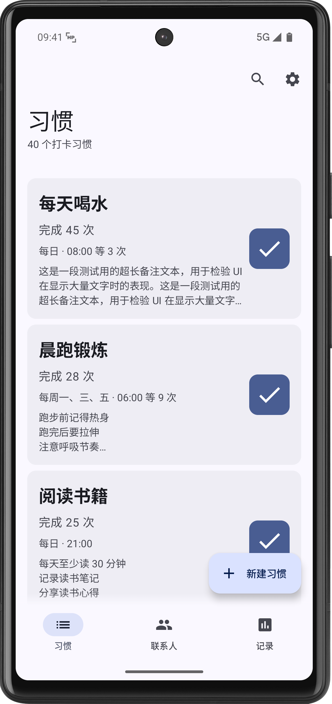
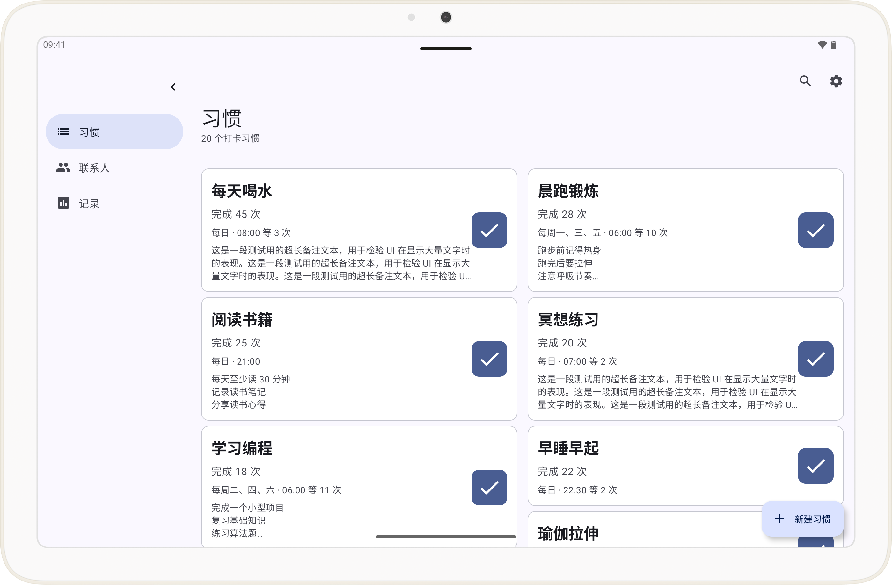

# HabitPulse

<div align="center">

[](https://choosealicense.com/licenses/mit/)
[](https://developer.android.com/)
[](https://kotlinlang.org/)
[](https://developer.android.com/jetpack/compose/bom)
[](https://developer.android.com/training/data-storage/room)
[](https://developer.android.com/about/versions/oreo/android-8.0-api-26)

</div>

---

## 📱 简介

**HabitPulse** 是一款采用 Material Design 3 设计风格的 Android 习惯追踪应用，致力于帮助用户建立和维持良好的日常习惯。通过简洁直观的界面设计和智能化的提醒机制，让习惯养成变得更加轻松有效。

> 💡 HabitPulse 使用 AI 辅助开发。如果您使用 Qwen Code 或 Claude Code 进行二次开发，请阅读 [`QWEN.md`](QWEN.md) 以获取重要信息。

> 🌏 [English Version](doc/readme/README_EN-US.md) | 中文版本

---

## ✨ 功能特性

### 🎯 核心功能
- **习惯追踪**：创建、管理和追踪日常习惯，记录每一次打卡
- **打卡记录**：完整的打卡历史记录，支持查看任意日期的完成情况
- **联系人监督**：添加监督人邮箱或电话，习惯完成情况可通知指定联系人（计划中）
- **智能提醒**：基于时间的提醒功能，帮助用户坚持习惯（计划中）

### 🎨 UI/UX 特性
- **Material Design 3**：采用最新的 MD3 设计规范，界面简洁美观
- **动态配色**：支持 Android 12+ 的动态主题色（Material You）
- **响应式布局**：完美适配手机和平板，支持横竖屏切换
- **分屏支持**：支持多窗口和画中画模式
- **无障碍优化**：完整的 TalkBack 支持，关怀每一位用户
- **预测性返回手势**：Android 13+ 预测性返回手势支持

### 🔧 技术特性
- **Jetpack Compose**：声明式 UI 框架，现代化开发体验
- **Room 数据库**：本地数据持久化，离线可用
- **ViewModel + Flow**：响应式架构，数据驱动 UI
- **导航组件**：Navigation Compose 实现流畅的页面切换动画

---

## 🖼️ 界面预览

<div align="center">

| <div align="center">**手机界面**</div> | <div align="center">**平板界面**</div> |
|---|---|
|  |  |

</div>

---

## 🚀 快速开始

### 环境要求
- **Android Studio**：最新版
- **JDK**：17 或更高版本
- **Android SDK**：
  - 最低 SDK：26 (Android 8.0)
  - 目标 SDK：36 (Android 16)

### 克隆项目
```bash
git clone https://github.com/darrindeyoung791/HabitPulse.git
cd HabitPulse
```

### 构建项目

使用最新版 Android Studio 打开项目，根据提示操作。

或使用其他 IDE 或编辑器。

```bash
# 使用 Gradle Wrapper 构建
./gradlew assembleDebug

# 或使用 Android Studio 打开项目后直接运行
```

> [!IMPORTANT]
> - 您可能需要在项目中手动修改 [`gradle.properties`](gradle.properties) 中的 JDK 路径。
> - 本项目配置使用了来自腾讯云、阿里云的镜像，若您是中国大陆外的开发者，需要自行修改。

#### VSCode 用户

如果您使用 VSCode 进行开发，需要在 [`.vscode/settings.json`](.vscode/settings.json) 中配置 JDK 17 路径：

```json
{
    "java.jdt.ls.java.home": "C:\\\\Program Files\\\\Java\\\\jdk-17",
    "java.home": "C:\\\\Program Files\\\\Java\\\\jdk-17"
}
```

> ⚠️ **重要**：请根据您的实际 JDK 安装路径修改上述配置。Windows 系统默认路径通常为 `C:\\Program Files\\Java\\jdk-17`，macOS 通常为 `/Library/Java/JavaVirtualMachines/jdk-17.jdk/Contents/Home`。

配置完成后，按 `Ctrl+Shift+P` 并选择 **"Java: Clean Java Language Server Workspace"**，或重新加载 VSCode 窗口以使配置生效。

### 安装应用
```bash
# 通过 ADB 安装到连接的设备
./gradlew installDebug
```

---

## 🛠️ 技术栈

| 组件 | 版本 | 说明 |
|------|------|------|
| **语言** | Kotlin 2.3.20 | 现代化 Android 开发语言 |
| **UI 框架** | Jetpack Compose (BOM 2026.03.00) | 声明式 UI 框架 |
| **Material 3** | 1.4.0 | Material Design 3 组件库 |
| **导航** | Navigation Compose 2.8.0 | 页面导航与动画 |
| **数据库** | Room 2.8.4 | 本地数据持久化 |
| **生命周期** | 2.10.0 | 生命周期感知组件 |
| **ViewModel** | 2.8.7 | UI 状态管理 |
| **构建工具** | Gradle 9.4.0 + AGP 9.1.0 | 项目构建系统 |
| **JVM 目标** | Java 17 | 编译字节码版本 |

---

## 📦 项目结构

```
HabitPulse/
├── app/
│   ├── src/main/
│   │   ├── java/io/github/darrindeyoung791/habitpulse/
│   │   │   ├── MainActivity.kt              # 主入口
│   │   │   ├── SettingsActivity.kt          # 设置页面
│   │   │   ├── HabitPulseApplication.kt     # Application 类
│   │   │   ├── navigation/                  # 导航图
│   │   │   ├── data/                        # 数据层
│   │   │   │   ├── model/                   # 数据模型
│   │   │   │   ├── database/                # Room 数据库
│   │   │   │   └── repository/              # 数据仓库
│   │   │   ├── viewmodel/                   # ViewModel 层
│   │   │   └── ui/                          # UI 层
│   │   │       ├── screens/                 # 页面组件
│   │   │       └── theme/                   # 主题样式
│   │   └── res/                             # 资源文件
│   └── build.gradle.kts                     # 模块构建配置
├── gradle/                                  # Gradle 包装器
├── QWEN.md                                  # 项目上下文文档
└── README.md                                # 项目说明文档
```

---

## 📄 数据库设计

### 核心数据表

#### habits（习惯表）
存储用户创建的所有习惯信息。

| 字段 | 类型 | 说明 |
|------|------|------|
| id | TEXT (PRIMARY KEY) | 习惯唯一标识符 (UUID) |
| title | TEXT | 习惯标题 |
| repeatCycle | TEXT | 重复周期 (DAILY/WEEKLY) |
| repeatDays | TEXT | 重复日期 (JSON 格式) |
| reminderTimes | TEXT | 提醒时间 (JSON 格式) |
| notes | TEXT | 备注信息 |
| supervisionMethod | TEXT | 监督方式 (NONE/EMAIL/SMS) |
| supervisorEmails | TEXT | 监督人邮箱 (JSON 格式) |
| supervisorPhones | TEXT | 监督人电话 (JSON 格式) |
| completedToday | INTEGER | 今日完成状态 (0/1) |
| completionCount | INTEGER | 总完成次数 |
| lastCompletedDate | INTEGER | 最后完成时间戳 |
| createdDate | INTEGER | 创建时间戳 |
| modifiedDate | INTEGER | 修改时间戳 |

#### habit_completions（打卡记录表）
记录每次习惯打卡的详细信息。

| 字段 | 类型 | 说明 |
|------|------|------|
| id | TEXT (PRIMARY KEY) | 记录唯一标识符 (UUID) |
| habitId | TEXT (FOREIGN KEY) | 关联习惯 ID |
| completedDate | INTEGER | 完成时间戳 |
| completedDateLocal | TEXT | 本地日期 (yyyy-MM-dd) |
| timeZone | TEXT | 时区信息 |

> 📚 详细的数据库设计文档将在未来更新中给出

---

## 🤝 贡献指南

我们欢迎各种形式的贡献！

### 如何贡献
1. **Fork** 本项目
2. 创建您的特性分支 (`git checkout -b feature/AmazingFeature`)
3. 提交您的修改 (`git commit -m 'Add some AmazingFeature'`)
4. 推送到分支 (`git push origin feature/AmazingFeature`)
5. 开启一个 **Pull Request**

### 开发环境设置
1. 克隆项目后，使用 Android Studio 打开
2. 同步 Gradle 项目
3. 运行 `./gradlew assembleDebug` 确保构建成功
4. 在模拟器或真机上运行调试

### 代码规范
- 遵循 [Kotlin 代码风格指南](https://kotlinlang.org/docs/coding-conventions.html)
- 使用 KDoc 编写文档注释
- 保持代码整洁，遵循 DRY 原则

### 报告问题
发现 Bug？请通过 [Issues](https://github.com/darrindeyoung791/HabitPulse/issues) 向我们报告。

---


## 📜 开源协议

本项目采用 [MIT 协议](LICENSE) 开源。

```
MIT License

Copyright (c) 2026 darrindeyoung791

Permission is hereby granted, free of charge, to any person obtaining a copy
of this software and associated documentation files (the "Software"), to deal
in the Software without restriction, including without limitation the rights
to use, copy, modify, merge, publish, distribute, sublicense, and/or sell
copies of the Software, and to permit persons to whom the Software is
furnished to do so, subject to the following conditions:

The above copyright notice and this permission notice shall be included in all
copies or substantial portions of the Software.

THE SOFTWARE IS PROVIDED "AS IS", WITHOUT WARRANTY OF ANY KIND, EXPRESS OR
IMPLIED, INCLUDING BUT NOT LIMITED TO THE WARRANTIES OF MERCHANTABILITY,
FITNESS FOR A PARTICULAR PURPOSE AND NONINFRINGEMENT. IN NO EVENT SHALL THE
AUTHORS OR COPYRIGHT HOLDERS BE LIABLE FOR ANY CLAIM, DAMAGES OR OTHER
LIABILITY, WHETHER IN AN ACTION OF CONTRACT, TORT OR OTHERWISE, ARISING FROM,
OUT OF OR IN CONNECTION WITH THE SOFTWARE OR THE USE OR OTHER DEALINGS IN THE
SOFTWARE.
```

---

<div align="center">

**由 darrindeyoung791 用 ❤️ 制作**

**Made with ❤️ by darrindeyoung791**

[⭐ Star this repo](https://github.com/darrindeyoung791/HabitPulse/stargazers) | [🍴 Fork](https://github.com/darrindeyoung791/HabitPulse/fork) | [📢 Issues](https://github.com/darrindeyoung791/HabitPulse/issues)

</div>
