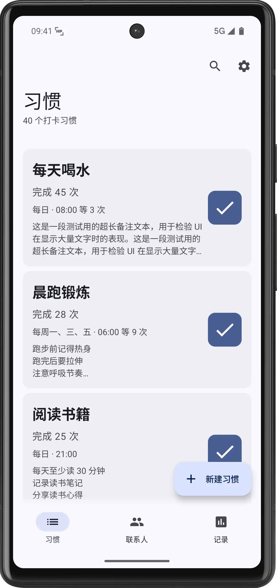
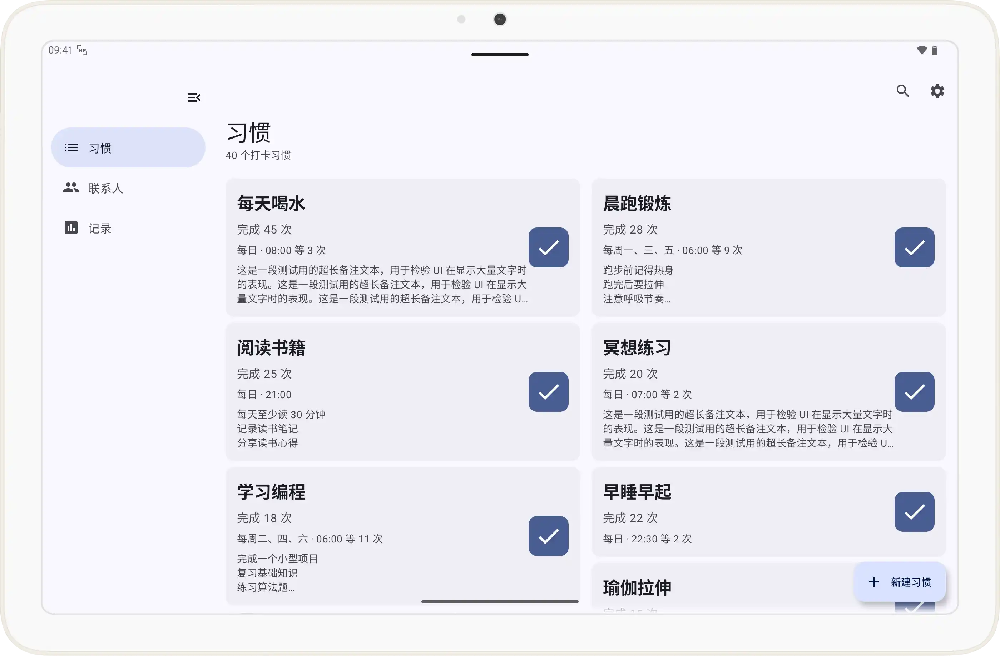
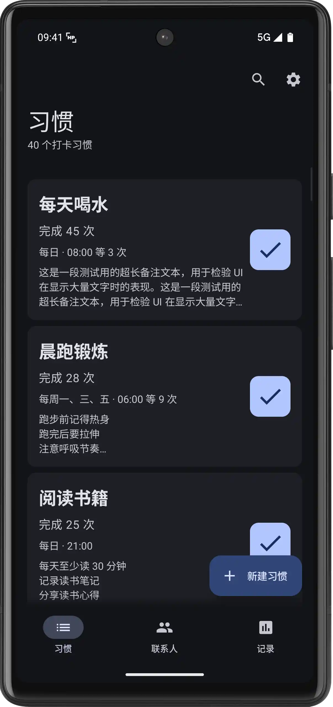
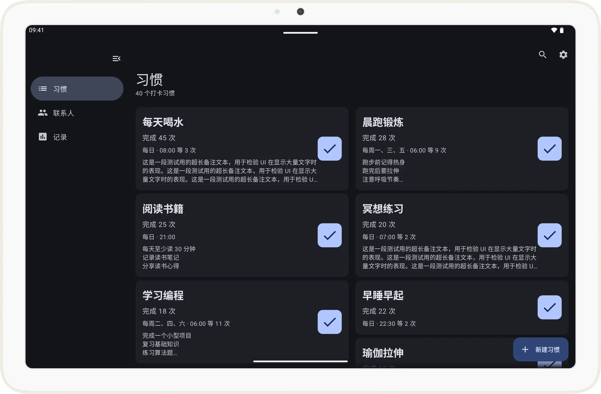

# HabitPulse

<div align="center">

[](https://choosealicense.com/licenses/mit/)
[](https://developer.android.com/)
[](https://kotlinlang.org/)
[](https://developer.android.com/jetpack/compose/bom)
[](https://developer.android.com/training/data-storage/room)
[](https://developer.android.com/about/versions/oreo)

</div>

---

## 📱 简介

**HabitPulse** 是一款采用 Material Design 3 设计风格的 Android 习惯追踪应用，致力于帮助用户建立和维持良好的日常习惯。通过简洁直观的界面设计和智能化的提醒机制，让习惯养成变得更加轻松有效。

> [!NOTE]
>
> HabitPulse 使用 AI 辅助开发。如果你使用 Qwen Code、OpenCode 等 AI 工具进行二次开发，请让 AI 阅读 [`QWEN.md`](QWEN.md) 和 [`AGENTS.md`](AGENTS.md) 以获取重要信息。你可能需要编辑 [`.qwen\settings.json`](.qwen\settings.json) 中的设置。
>
> 本项目使用 **OpenSpec** 工作流进行变更管理。参见 [`openspec/`](openspec/) 目录获取更多信息。

> 🌏 [English Version](devdoc/readme/README_EN-US.md) | 中文版本

---

## ✨ 功能特性

### 🎯 核心功能
- [x] **习惯追踪**：创建、管理和追踪日常习惯，记录每一次打卡
- [x] **打卡记录**：完整的打卡历史记录，支持查看任意日期的完成情况
- [x] **多选与排序**：长按习惯卡片进入多选模式，支持拖拽排序和批量删除
- [x] **联系人监督**：添加监督人邮箱或电话，在联系人页面统一管理
- [x] **奖励弹窗**：完成打卡时展示庆祝动画（12 边形多边形 + MD3 缓动）
- [x] **搜索与过滤**：实时搜索习惯，按习惯/日期筛选打卡记录
- [x] **智能提醒**：支持设置每日/每周重复提醒时间
- [x] **保活服务**：前台服务保持应用活跃，支持开机自启
- [ ] **通知提醒**：基于 AlarmManager 的准时提醒（计划中）
- [ ] **局域网同步**：无需注册账号，通过局域网在多台设备间同步数据（计划中，[方案详情](devdoc/lan-sync-plan.md)）
- [ ] **AI 辅助规划**：接入大语言模型 API，用 AI 辅助用户创建习惯（计划中）
- [ ] **记录可视化**：使用 WebView 和网页制作可视化组件，如一周打卡时间分布等（计划中）

### 🎨 UI/UX 特性
- **Material Design 3**：采用最新的 MD3 设计规范，界面简洁美观
- **动态配色**：支持 Android 12+ 的动态主题色（Material You）
- **响应式布局**：完美适配手机和平板，支持横竖屏切换（Bottom Bar / Rail / Drawer）
- **无障碍优化**：完整的 TalkBack 支持，关怀每一位用户
- **预测性返回手势**：Android 13+ 预测性返回手势支持
- **分屏支持**：多窗口模式无缝适配
- **多语言**：支持简体中文、繁体中文、英语
- **WebView 安全**：SSL 证书警告 + 外部链接离开确认

### 🔧 技术特性
- **Jetpack Compose**：声明式 UI 框架，现代化开发体验
- **Room 数据库**：本地数据持久化，离线可用
- **ViewModel + Flow**：响应式架构，数据驱动 UI
- **导航组件**：Navigation Compose 实现流畅的页面切换动画
- **DataStore**：现代化偏好存储方案
- **Foreground Service**：保活服务 + 开机自启广播接收器

---

## 🖼️ 界面预览

<div align="center">

| <div align="center">**手机界面**</div> | <div align="center">**平板界面**</div> |
|---|---|
|  |  |
|  |  |

</div>

---

## 🚀 快速开始

### 环境要求
- **Android Studio**：最新版
- **JDK**：17 或更高版本
- **Android SDK**：
  - 最低 SDK：26 (Android 8.0)
  - 目标 SDK：36 (Android 16)

### 克隆项目
```bash
git clone https://github.com/darrindeyoung791/HabitPulse.git
cd HabitPulse
```

### 构建项目

使用最新版 Android Studio 打开项目，根据提示操作。

或使用其他 IDE 或编辑器。

```bash
# 使用 Gradle Wrapper 构建
./gradlew assembleDebug

# 或使用 Android Studio 打开项目后直接运行
```

> [!IMPORTANT]
> - 你可能需要在项目中手动修改 [`gradle.properties`](gradle.properties) 中的 JDK 路径。
> - 本项目配置使用了来自腾讯云、阿里云的镜像，若你是中国大陆外的开发者，需要自行修改。

#### VSCode 用户

如果你使用 VSCode 进行开发，需要在 [`.vscode/settings.json`](.vscode/settings.json) 中配置 JDK 17 路径：

```json
{
    "java.jdt.ls.java.home": "C:\\\\Program Files\\\\Java\\\\jdk-17",
    "java.home": "C:\\\\Program Files\\\\Java\\\\jdk-17"
}
```

> [!IMPORTANT]
>
> 请根据你的实际 JDK 安装路径修改上述配置。Windows 系统默认路径通常为 `C:\\Program Files\\Java\\jdk-17`，macOS 通常为 `/Library/Java/JavaVirtualMachines/jdk-17.jdk/Contents/Home`。
>
> 配置完成后，按 `Ctrl+Shift+P` 并选择 **"Java: Clean Java Language Server Workspace"**，或重新加载 VSCode 窗口以使配置生效。

### 安装应用
```bash
# 通过 ADB 安装到连接的设备
./gradlew installDebug
```

---

## 🛠️ 技术栈

| 组件 | 版本 | 说明 |
|------|------|------|
| **语言** | Kotlin 2.3.20 | 现代化 Android 开发语言 |
| **UI 框架** | Jetpack Compose (BOM 2026.03.00) | 声明式 UI 框架 |
| **Material 3** | 1.4.0 | Material Design 3 组件库 |
| **导航** | Navigation Compose 2.8.0 | 页面导航与动画 |
| **数据库** | Room 2.8.4 | 本地数据持久化 |
| **生命周期** | 2.10.0 | 生命周期感知组件 |
| **ViewModel** | 2.8.7 | UI 状态管理 |
| **前台服务** | Android Foreground Service | 保活与开机自启 |
| **偏好存储** | DataStore 1.1.1 | 现代化偏好存储 |
| **构建工具** | Gradle 9.4.0 + AGP 9.1.0 | 项目构建系统 |
| **JVM 目标** | Java 17 | 编译字节码版本 |

---

## 📦 项目结构

```
HabitPulse/
├── app/
│   ├── src/main/
│   │   ├── java/io/github/darrindeyoung791/habitpulse/
│   │   │   ├── MainActivity.kt              # 主入口 (NavHost)
│   │   │   ├── SettingsActivity.kt          # 设置页面
│   │   │   ├── LauncherActivity.kt          # 启动路由 (Welcome / Main)
│   │   │   ├── WelcomeActivity.kt           # 新用户引导页
│   │   │   ├── OpenSourceLicensesActivity.kt # 开源许可证
│   │   │   ├── HabitPulseApplication.kt     # Application 类
│   │   │   ├── navigation/                  # 导航图与路由定义
│   │   │   ├── data/                        # 数据层
│   │   │   │   ├── model/                   # 数据模型 (Habit, HabitCompletion)
│   │   │   │   ├── database/                # Room 数据库 + DAO + Converter
│   │   │   │   ├── repository/              # 数据仓库
│   │   │   │   └── preferences/             # DataStore 偏好存储
│   │   │   ├── viewmodel/                   # ViewModel 层
│   │   │   ├── ui/                          # UI 层
│   │   │   │   ├── screens/                 # 页面组件 (Home, Habit, Records 等)
│   │   │   │   ├── theme/                   # 主题样式 (Color, Type, Theme)
│   │   │   │   └── utils/                   # UI 工具 (防抖, 导航守卫)
│   │   │   ├── service/                     # 前台保活服务
│   │   │   ├── receiver/                    # 开机自启广播接收器
│   │   │   └── utils/                       # 工具类 (通知, 无障碍, 偏好)
│   │   └── res/                             # 资源文件 (多语言, 主题, 图片)
│   └── build.gradle.kts                     # 模块构建配置
├── gradle/                                  # Gradle 包装器
├── docs/                                    # VitePress 用户文档站点
│   ├── .vitepress/                          # VitePress 配置与主题
│   ├── docs/                                # 文档内容 (Markdown)
│   └── package.json                         # Node.js 项目配置
├── openspec/                                # OpenSpec 变更管理工作流
├── QWEN.md                                  # AI 项目上下文文档
├── AGENTS.md                                # AI 代理项目上下文文档
└── README.md                                # 项目说明文档
```

---

## 📖 用户文档站

HabitPulse 维护一个面向用户的文档站点，使用 **VitePress** 构建并通过 GitHub Actions 自动部署到 **GitHub Pages**。

- **访问地址**：[https://darrindeyoung791.github.io/HabitPulse/](https://darrindeyoung791.github.io/HabitPulse/)
- **技术栈**：VitePress ^2.0.0-alpha、默认主题（已定制）、本地搜索
- **文档内容**：功能介绍、上手教程（首次使用 → 创建习惯 → 打卡 → 排序删除）、高级设置（保活、存储清理、平板模式）、下载与团队信息
- **目标受众**：HabitPulse 的**终端用户**，帮助用户了解和使用应用

### 本地开发

```bash
cd docs
npm install
npm run docs:dev    # 开发服务器 http://localhost:5173
npm run docs:build  # 构建到 docs/.vitepress/dist/
```

> 文案规范详见 [`docs/README.md`](docs/README.md)，包含术语表和中西文混排指南。

---

## 📄 数据库设计

### 核心数据表

#### habits（习惯表）
存储用户创建的所有习惯信息。

| 字段 | 类型 | 说明 |
|------|------|------|
| id | TEXT (PRIMARY KEY) | 习惯唯一标识符 (UUID) |
| title | TEXT | 习惯标题 |
| repeatCycle | TEXT | 重复周期 (DAILY/WEEKLY) |
| repeatDays | TEXT | 重复日期 (JSON 格式) |
| reminderTimes | TEXT | 提醒时间 (JSON 格式) |
| notes | TEXT | 备注信息 |
| supervisionMethod | TEXT | 监督方式 (NONE/EMAIL/SMS) |
| supervisorEmails | TEXT | 监督人邮箱 (JSON 格式) |
| supervisorPhones | TEXT | 监督人电话 (JSON 格式) |
| completedToday | INTEGER | 今日完成状态 (0/1) |
| completionCount | INTEGER | 总完成次数 |
| lastCompletedDate | INTEGER | 最后完成时间戳 |
| createdDate | INTEGER | 创建时间戳 |
| modifiedDate | INTEGER | 修改时间戳 |
| sortOrder | INTEGER | 排序顺序，数值越小越靠前，用于自定义排序 |
| timeZone | TEXT | 时区 ID，用于处理跨时区场景 |

#### habit_completions（打卡记录表）
记录每次习惯打卡的详细信息。

| 字段 | 类型 | 说明 |
|------|------|------|
| id | TEXT (PRIMARY KEY) | 记录唯一标识符 (UUID) |
| habitId | TEXT (FOREIGN KEY) | 关联习惯 ID |
| completedDate | INTEGER | 完成时间戳 |
| completedDateLocal | TEXT | 本地日期 (yyyy-MM-dd) |
| timeZone | TEXT | 时区信息 |

> 📚 详细的数据库设计文档将在未来更新中给出

---

## 🤝 贡献指南

我们欢迎各种形式的贡献！

现阶段欢迎优先通过 [issue](https://github.com/darrindeyoung791/HabitPulse/issues) 反馈问题或提出建议。中英文 issue 均可，其他语言我们将翻译后处理，并统一使用英文回复。

如果你想提交 PR，因为本项目是业余维护，review 和合并可能需要较长时间，敬请谅解。

### OpenSpec 工作流
本项目使用 **OpenSpec** 进行变更管理：

1. **Propose**：提出变更方案（`openspec/` 目录）
2. **Design / Specs**：编写设计和规格说明
3. **Tasks**：拆解为可执行的任务清单
4. **Apply**：按任务逐项实施
5. **Archive**：完成后归档

使用 `openspec` CLI 工具管理变更，所有变更记录保存在 `openspec/changes/` 目录。

### 报告问题
发现 Bug？请通过 [Issues](https://github.com/darrindeyoung791/HabitPulse/issues) 向我们报告。

---


## 📜 开源协议

本项目采用 [MIT 协议](LICENSE) 开源。

```
MIT License

Copyright (c) 2026 darrindeyoung791

Permission is hereby granted, free of charge, to any person obtaining a copy
of this software and associated documentation files (the "Software"), to deal
in the Software without restriction, including without limitation the rights
to use, copy, modify, merge, publish, distribute, sublicense, and/or sell
copies of the Software, and to permit persons to whom the Software is
furnished to do so, subject to the following conditions:

The above copyright notice and this permission notice shall be included in all
copies or substantial portions of the Software.

THE SOFTWARE IS PROVIDED "AS IS", WITHOUT WARRANTY OF ANY KIND, EXPRESS OR
IMPLIED, INCLUDING BUT NOT LIMITED TO THE WARRANTIES OF MERCHANTABILITY,
FITNESS FOR A PARTICULAR PURPOSE AND NONINFRINGEMENT. IN NO EVENT SHALL THE
AUTHORS OR COPYRIGHT HOLDERS BE LIABLE FOR ANY CLAIM, DAMAGES OR OTHER
LIABILITY, WHETHER IN AN ACTION OF CONTRACT, TORT OR OTHERWISE, ARISING FROM,
OUT OF OR IN CONNECTION WITH THE SOFTWARE OR THE USE OR OTHER DEALINGS IN THE
SOFTWARE.
```

---

<div align="center">

**由 darrindeyoung791 用 ❤️ 制作**

**Made with ❤️ by darrindeyoung791**

[⭐ Star this repo](https://github.com/darrindeyoung791/HabitPulse/stargazers) | [🍴 Fork](https://github.com/darrindeyoung791/HabitPulse/fork) | [📢 Issues](https://github.com/darrindeyoung791/HabitPulse/issues)

</div>
