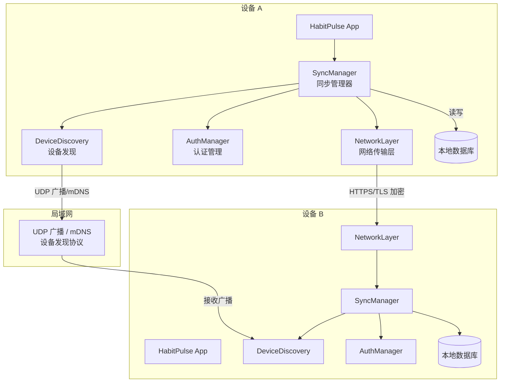
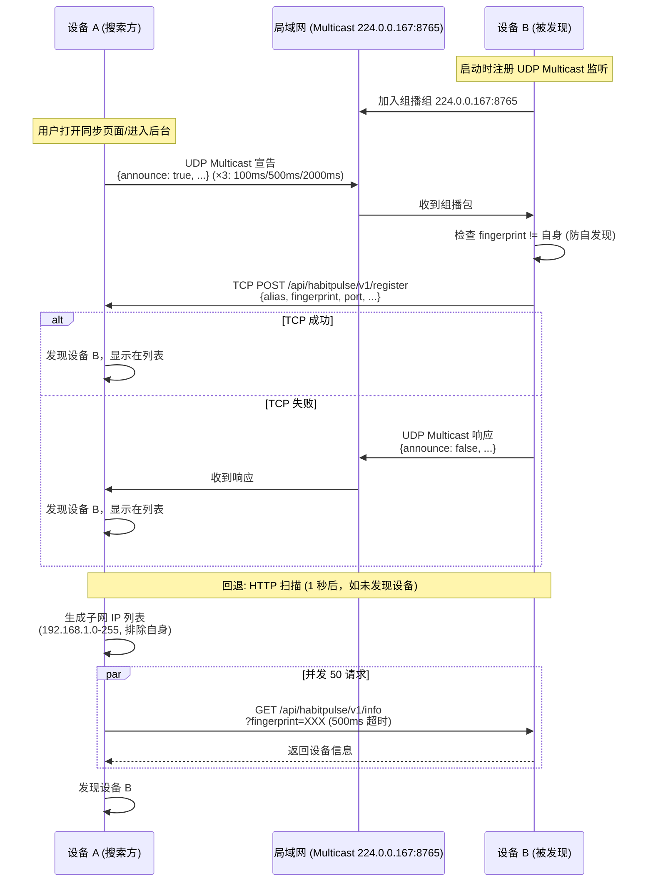
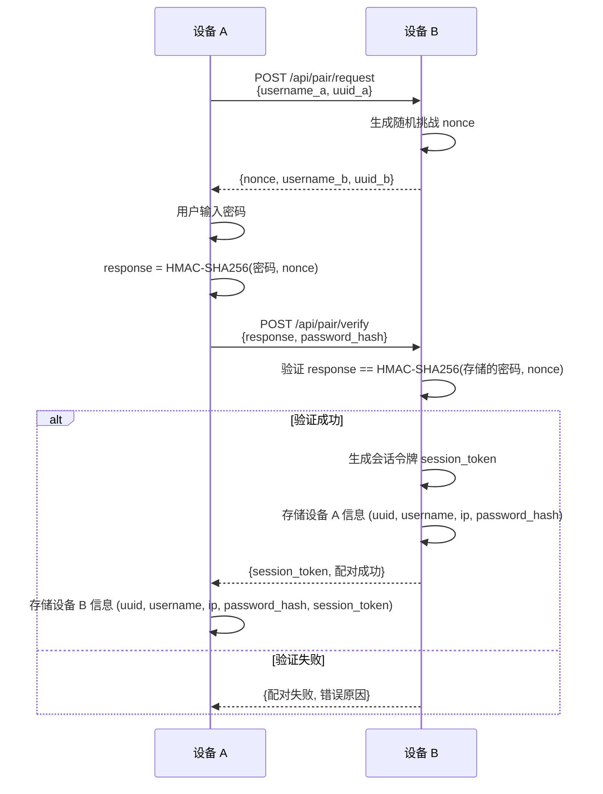
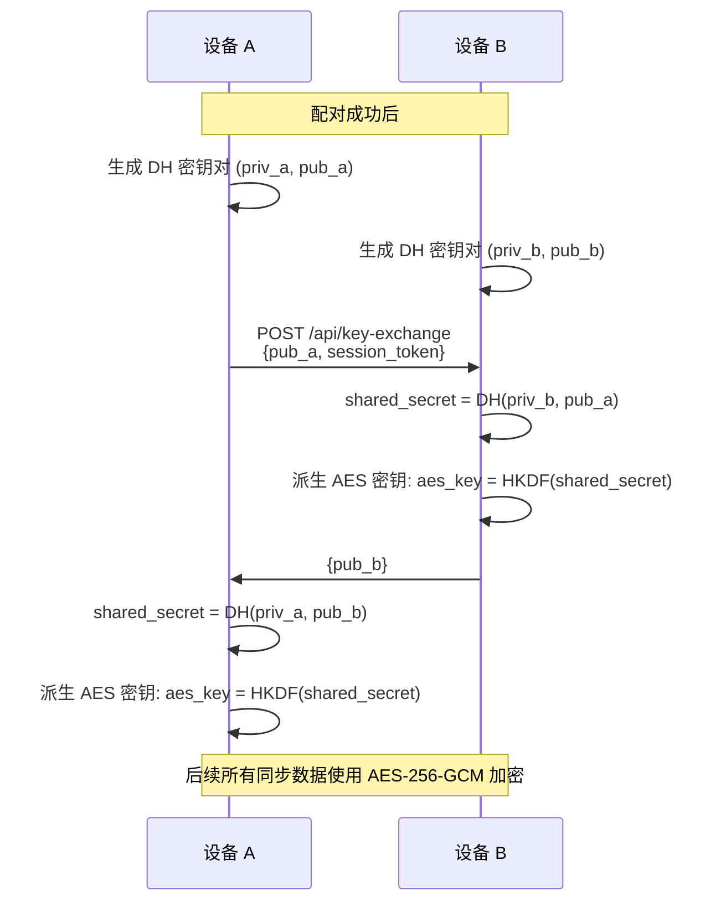
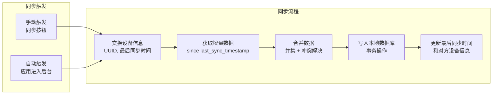
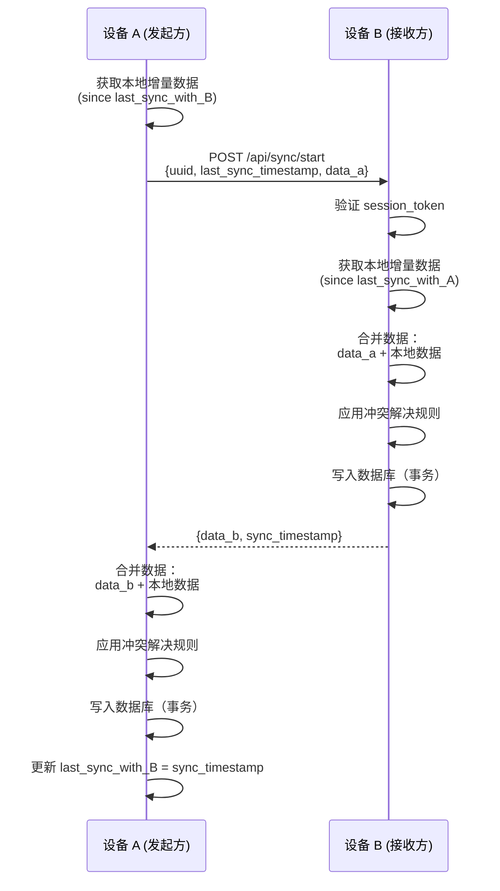
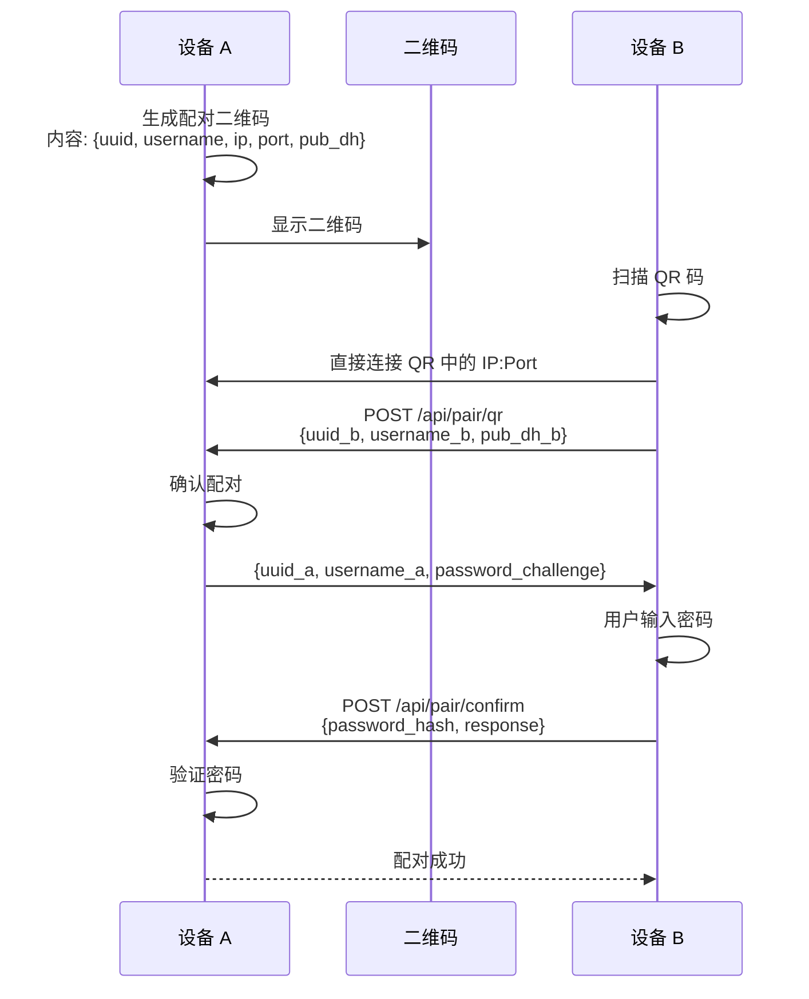

# 局域网同步方案规划（WIP）

## 概述

实现无需注册账号的局域网设备数据同步功能，允许用户在不联网的情况下，通过局域网在多台设备间同步 HabitPulse 数据。

### 核心原则
- **无需账号系统**：不依赖云端服务器，完全本地同步
- **局域网安全**：设备发现、认证、传输均在局域网内完成
- **用户可控**：用户明确授权每台设备的配对
- **数据完整性**：同步时合并双方数据，避免丢失

---

## 1. 架构设计



---

## 2. 设备发现机制

### 2.1 发现协议

**方案选择**：UDP Multicast（主） + HTTP Scan（备）—— 借鉴 LocalSend 成熟方案

LocalSend 是一个开源跨平台局域网文件传输工具（GitHub 170k+ stars），其发现机制经过大规模验证：
- **UDP Multicast**：轻量、低延迟、跨平台兼容
- **HTTP Scan 回退**：当组播被路由器阻止时自动启用
- **Fingerprint 防自发现**：用 TLS 证书哈希（或随机字符串）标识自身

| 特性 | LocalSend 方案 (UDP Multicast + HTTP Scan) | 原方案 (mDNS/android.net.nsd) |
|------|------|----------|
| 实现复杂度 | 中（需 RawDatagramSocket + HTTP 客户端） | 中高（NsdManager API 复杂且碎片化） |
| Android 兼容性 | ✅ `RawDatagramSocket` 原生支持，无 API 碎片化 | ⚠️ `android.net.nsd` 在不同厂商 ROM 上行为不一致 |
| 回退机制 | ✅ 自动 HTTP 扫描 /24 子网 | ❌ mDNS 无内置回退 |
| 延迟 | 极低（100ms 内响应） | 低（依赖系统 mDNS 响应速度） |
| 跨路由器/子网 | ⚠️ 组播不跨子网，但 HTTP Scan 可弥补 | ⚠️ 同样受限 |
| 端口需求 | 单端口 (TCP+UDP 同端口) | 5353 (mDNS 标准) + 自定义 HTTP 端口 |
| 实际验证 | ✅ LocalSend 已在生产环境使用 3+ 年 | 理论可行 |

**推荐方案**：UDP Multicast + HTTP Scan 回退（LocalSend 模式）

### 2.2 网络参数

```
UDP Multicast 组播地址: 224.0.0.167
  └─ 选择理由: 位于 224.0.0.0/24 范围，
     某些 Android 设备仅此范围可接收组播
TCP/UDP 端口: 8765 (可自定义)
HTTP 发现超时: 500ms (每 IP)
HTTP 扫描并发: 50 (每子网)
```

### 2.3 发现 DTO 格式

**UDP Multicast 载荷** (JSON，UTF-8 编码，通过 `RawDatagramSocket` 发送):

```json
{
  "alias": "我的手机",
  "version": "1.0",
  "deviceModel": "Pixel 7",
  "deviceType": "mobile",
  "fingerprint": "<SHA-256 hash 或 UUID>",
  "port": 8765,
  "protocol": "http",
  "announce": true
}
```

| 字段 | 说明 |
|------|------|
| `alias` | 设备用户名 |
| `version` | 同步协议版本 |
| `deviceModel` | 设备型号（可选） |
| `deviceType` | 设备类型：`mobile`、`tablet`、`desktop` |
| `fingerprint` | 设备唯一标识（用于防自发现），用 TLS 证书 SHA-256 哈希或设备 UUID |
| `port` | HTTP 服务器端口 |
| `protocol` | `http` 或 `https` |
| `announce` | `true` = 宣告自己在线，`false` = 仅响应 |

**HTTP 响应载荷** (`GET /api/habitpulse/v1/info`):

```json
{
  "alias": "我的手机",
  "version": "1.0",
  "deviceModel": "Pixel 7",
  "deviceType": "mobile",
  "fingerprint": "<设备指纹>"
}
```

**配对请求载荷** (`POST /api/habitpulse/v1/register`):

```json
{
  "alias": "我的手机",
  "version": "1.0",
  "deviceModel": "Pixel 7",
  "deviceType": "mobile",
  "fingerprint": "<设备指纹>",
  "port": 8765,
  "protocol": "http"
}
```

### 2.4 发现流程



### 2.5 智能扫描策略 (Smart Scan)

借鉴 LocalSend 的分层发现策略，自动选择最优路径：

```
StartSmartScan:
  1. 发送 UDP Multicast 宣告 (非阻塞，后台)
  2. 等待 1 秒
  3. 如果设备列表仍为空 → 启动 HTTP 扫描回退
     a. 获取前 3 个网络接口
     b. 对每个 /24 子网:
        - 生成 256 个 IP (排除自身)
        - 并发 50 请求 GET /api/habitpulse/v1/info
        - 500ms 超时/每 IP
```

**为什么分层**：
- 大多数家庭 WiFi 网络中，组播工作正常 → HTTP 扫描永不执行
- 当路由器阻止组播时（企业网络），自动回退到 HTTP 扫描
- 用户无感知，自动适配

### 2.6 防自发现 (Self-Discovery Prevention)

```kotlin
// 收到任何发现消息时：
if (incomingFingerprint == myFingerprint) {
    return // 忽略自己的消息
}
```

Fingerprint 生成方案（二选一）：
- **HTTPS 模式**：TLS 证书的 SHA-256 哈希（LocalSend 方案）
- **HTTP 模式**：随机生成的 UUID 字符串（持久化存储）

### 2.7 服务注册

HTTP 服务器监听端口 `8765`，提供以下端点用于发现：

| 端点 | 方法 | 说明 | 认证 |
|------|------|------|------|
| `/api/habitpulse/v1/info` | GET | 设备信息查询 | 无需 (仅返回设备信息) |
| `/api/habitpulse/v1/register` | POST | 设备注册/宣告 | 无需 (用于发现阶段) |

### 2.8 设备数据结构

```kotlin
data class DiscoveredDevice(
    val alias: String,
    val version: String,
    val deviceModel: String?,
    val deviceType: DeviceType,       // mobile, tablet, desktop
    val fingerprint: String,          // 用于防自发现和识别
    val ip: String,                   // 发现来源 IP
    val port: Int,                    // HTTP 服务端口
    val protocol: ProtocolType,       // http / https
    val discoveryMethod: DiscoveryMethod, // multicast / http_scan
)

enum class DiscoveryMethod {
    Multicast,    // 通过 UDP Multicast 发现
    HttpScan,     // 通过 HTTP 扫描发现
}
```

### 2.9 Android 实现要点

**UDP Multicast 监听**:
```kotlin
// 绑定 UDP DatagramSocket，加入组播组
val multicastAddress = InetAddress.getByName("224.0.0.167")
val socket = MulticastSocket(8765)
socket.joinGroup(multicastAddress)

// 接收消息
val buffer = ByteArray(1024)
val packet = DatagramPacket(buffer, buffer.size)
socket.receive(packet)
val dto = Json.decodeFromString<MulticastDto>(String(packet.data))
```

**UDP Multicast 宣告**:
```kotlin
// 发送 3 次，间隔 100ms/500ms/2000ms
val dto = MulticastDto(
    alias = deviceName,
    version = "1.0",
    fingerprint = myFingerprint,
    port = 8765,
    protocol = "http",
    announce = true
)
val data = Json.encodeToString(dto).toByteArray()
for (delay in listOf(100L, 500, 2000)) {
    delay(delay)
    val packet = DatagramPacket(data, data.size, multicastAddress, 8765)
    socket.send(packet)
}
```

**HTTP 扫描回退**:
```kotlin
// 生成子网 IP 列表
val subnet = "192.168.1"
val ips = (0..255).map { "$subnet.$it" }.filter { it != myIp }

// 并发 50 请求
ips.chunked(50).forEach { batch ->
    coroutineScope {
        batch.map { ip ->
            async {
                try {
                    val response = client.get("http://$ip:8765/api/habitpulse/v1/info")
                    // 解析并注册设备
                } catch (_: Exception) { /* 忽略超时 */ }
            }
        }.awaitAll()
    }
}
```

**权限需求**:
```xml
<uses-permission android:name="android.permission.INTERNET" />
<uses-permission android:name="android.permission.ACCESS_NETWORK_STATE" />
<uses-permission android:name="android.permission.ACCESS_WIFI_STATE" />
<uses-permission android:name="android.permission.CHANGE_WIFI_MULTICAST_STATE" />
```

---

## 3. 安全认证机制

### 3.1 设备身份

| 属性 | 说明 |
|------|------|
| **设备 UUID** | 首次启动时随机生成的 UUID v4，持久化存储 |
| **用户名** | 用户自定义，用于识别设备（如"我的手机"、"平板"） |
| **密码** | 用户设置，用于配对认证 |

### 3.2 密码存储

```
密码不存储明文，存储方式：
hash = PBKDF2(密码, salt, iterations=100000, key_length=256)
salt 随机生成，与 hash 一起存储
```

### 3.3 配对流程



### 3.4 会话管理

| 属性 | 说明 |
|------|------|
| **session_token** | 配对成功后生成，UUID v4 |
| **有效期** | 24 小时，每次同步刷新 |
| **传输方式** | 后续请求通过 `Authorization: Bearer <token>` 传递 |

---

## 4. 加密传输

### 4.1 传输协议

**方案选择**：应用层加密（无需 HTTPS 证书）

```
HTTP POST/GET over LAN
请求/响应体使用 AES-256-GCM 加密
密钥通过配对阶段的 Diffie-Hellman 交换生成
```

### 4.2 加密流程



### 4.3 数据包格式

```json
{
  "type": "sync_request",
  "session_token": "uuid-v4-token",
  "encrypted_data": "base64(aes_gcm_encrypt(sync_payload))",
  "iv": "base64(随机 IV 12 字节)",
  "auth_tag": "base64(GCM 认证标签 16 字节)"
}
```

---

## 5. 数据同步逻辑

### 5.1 同步策略

**方案**：双向增量同步 + 最后写入获胜 (Last-Write-Wins)



### 5.2 数据结构

**同步请求负载**：

```json
{
  "device_uuid": "设备 UUID",
  "last_sync_timestamp": 1712736000000,
  "data": {
    "habits": [
      {
        "id": "habit-uuid",
        "title": "习惯名称",
        "repeatCycle": "DAILY",
        "repeatDays": [1,2,3,4,5],
        "reminderTimes": ["08:00"],
        "notes": "",
        "supervisionMethod": "NONE",
        "supervisorEmails": [],
        "supervisorPhones": [],
        "completionCount": 5,
        "createdDate": 1712649600000,
        "modifiedDate": 1712736000000,
        "sortOrder": 0,
        "timeZone": "Asia/Shanghai"
      }
    ],
    "completions": [
      {
        "id": "completion-uuid",
        "habitId": "habit-uuid",
        "completedDate": 1712736000000,
        "completedDateLocal": "2026-04-10",
        "timeZone": "Asia/Shanghai"
      }
    ]
  }
}
```

### 5.3 冲突解决规则

| 冲突场景 | 解决策略 |
|----------|----------|
| 同一习惯在两台设备上都被修改 | 取 `modifiedDate` 较大的版本 |
| 同一习惯在一台设备被删除，另一台被修改 | 保留修改版本（删除视为误操作） |
| 同一习惯在一台设备被删除，另一台未修改 | 执行删除 |
| 完成记录重复（同一天同一习惯） | 合并为一条（去重） |
| 完成记录在一台设备被删除，另一台保留 | 保留（完成记录不删除） |

### 5.4 同步流程详细设计



---

## 6. 二维码同步方案

### 6.1 二维码配对流程



### 6.2 二维码内容

```json
{
  "type": "habitpulse_pair",
  "version": 1,
  "uuid": "设备 UUID",
  "username": "设备用户名",
  "ip": "192.168.1.100",
  "port": 8765,
  "pub_dh": "Base64 编码的 DH 公钥"
}
```

---

## 7. 网络层 API 设计

### 7.1 API 端点

**发现阶段**（无需认证）：

| 端点 | 方法 | 说明 | 认证 |
|------|------|------|------|
| `/api/habitpulse/v1/info?fingerprint=XXX` | GET | 设备信息查询（HTTP 扫描用） | 无需 |
| `/api/habitpulse/v1/register` | POST | 设备注册/宣告（Multicast 响应） | 无需 |

**配对阶段**（无需认证）：

| 端点 | 方法 | 说明 | 认证 |
|------|------|------|------|
| `/api/pair/request` | POST | 发起配对请求 | 无需 |
| `/api/pair/verify` | POST | 验证配对密码 | 无需 |
| `/api/pair/qr` | POST | 二维码配对发起 | 无需 |
| `/api/pair/confirm` | POST | 二维码配对确认 | 无需 |

**同步阶段**（需要 session_token + 加密）：

| 端点 | 方法 | 说明 | 认证 |
|------|------|------|------|
| `/api/key-exchange` | POST | DH 密钥交换 | session_token |
| `/api/sync/start` | POST | 开始同步 | session_token + 加密 |
| `/api/sync/status` | GET | 同步状态查询 | session_token |

> **与 LocalSend 对比**：LocalSend 的发现阶段端点为 `/api/localsend/v1/info` 和 `/api/localsend/v2/register`。
> 我们使用独立路径 `/api/habitpulse/v1/` 避免冲突，配对和同步端点为自建，不涉及 LocalSend。

### 7.2 HTTP 服务器实现

**方案**：使用 Ktor Server (Netty) 或 NanoHTTPD

| 方案 | 优点 | 缺点 |
|------|------|------|
| **Ktor Server** | Kotlin 原生，协程支持好，与项目技术栈一致 | 依赖较大 |
| **NanoHTTPD** | 轻量级，嵌入简单 | 功能有限，需自行实现加密 |

**推荐**：Ktor Server（与项目 Kotlin 技术栈一致，协程支持好）

### 7.3 端口与网络配置

```
默认端口: 8765 (TCP + UDP 共用)
组播地址: 224.0.0.167 (UDP)
组播端口: 8765 (与 HTTP 端口一致)
```

> **借鉴 LocalSend**: LocalSend 使用端口 53317 (TCP+UDP 共用)，组播地址 224.0.0.167。
> TCP/UDP 同端口简化了配置，只需开放一个防火墙规则。

---

## 8. 数据模型扩展

### 8.1 新增字段

**habits 表**：
```sql
-- 无需新增字段，现有字段已满足同步需求
-- modifiedDate 字段用于增量同步判断
```

**新增设备配对表**：
```sql
CREATE TABLE paired_devices (
    id TEXT PRIMARY KEY,              -- UUID
    deviceUuid TEXT NOT NULL,         -- 对方设备 UUID
    deviceName TEXT NOT NULL,         -- 对方设备用户名
    lastIp TEXT,                      -- 上次连接 IP
    lastPort INTEGER DEFAULT 8765,    -- 上次连接端口
    passwordHash TEXT NOT NULL,       -- 密码哈希
    sessionToken TEXT,                -- 当前会话令牌
    lastSyncTimestamp INTEGER,        -- 最后同步时间戳
    createdDate INTEGER NOT NULL,     -- 配对创建时间
    modifiedDate INTEGER NOT NULL     -- 最后修改时间
);

CREATE INDEX idx_deviceUuid ON paired_devices(deviceUuid);
```

### 8.2 本地配置

**UserPreferences 新增**：
```kotlin
data class SyncPreferences(
    val deviceUuid: String,           // 本设备 UUID
    val deviceName: String,           // 本设备用户名
    val syncEnabled: Boolean,         // 是否启用局域网同步
    val autoSyncOnBackground: Boolean,// 进入后台时自动同步
    val lastSyncTimestamp: Long,      // 全局最后同步时间
)
```

---

## 9. UI 设计

### 9.1 设置页新增选项

```
设置
├── 应用信息
├── 视觉选项
├── 通知选项
├── 局域网同步 (新增)
│   ├── 启用局域网同步 [开关]
│   ├── 设备名称: [我的手机]
│   ├── 已配对设备
│   │   ├── 我的平板 (最后同步: 2026-04-10 15:30)
│   │   │   ├── 立即同步
│   │   │   └── 取消配对
│   │   └── 我的平板 2 (最后同步: 2026-04-09 20:00)
│   │       ├── 立即同步
│   │       └── 取消配对
│   ├── 添加设备
│   │   ├── 搜索附近设备
│   │   └── 扫描二维码
│   └── 同步历史 (可选)
└── 关于
```

### 9.2 配对对话框

```
┌─────────────────────────────────┐
│         添加新设备               │
├─────────────────────────────────┤
│                                 │
│  发现以下设备:                   │
│  ┌───────────────────────────┐  │
│  │ 📱 我的平板               │  │
│  │    UUID: abc123...        │  │
│  │    IP: 192.168.1.105      │  │
│  │    [配对]                 │  │
│  └───────────────────────────┘  │
│                                 │
│  或扫描二维码: [扫描按钮]       │
│                                 │
└─────────────────────────────────┘
```

---

## 10. 权限与后台

### 10.1 Android 权限

```xml
<!-- 局域网同步所需权限 -->
<uses-permission android:name="android.permission.INTERNET" />
<uses-permission android:name="android.permission.ACCESS_NETWORK_STATE" />
<uses-permission android:name="android.permission.CHANGE_WIFI_MULTICAST_STATE" />
<uses-permission android:name="android.permission.ACCESS_WIFI_STATE" />
<uses-permission android:name="android.permission.CAMERA" /> <!-- 二维码扫描 -->
<uses-permission android:name="android.permission.FOREGROUND_SERVICE" />
<uses-permission android:name="android.permission.FOREGROUND_SERVICE_CONNECTED_DEVICE" />
```

### 10.2 后台服务

**SyncForegroundService**：
- 保持 HTTP 服务器运行
- 监听 mDNS 服务发现
- 处理同步请求
- 显示持久通知（用户可关闭）

---

## 11. 实现步骤

### 阶段 1：基础架构（预计 2-3 天）
1. 添加 Ktor Server 依赖
2. 实现 HTTP 服务器基础框架
3. 实现 mDNS 服务注册与发现
4. 设备 UUID 生成与存储

### 阶段 2：安全认证（预计 2-3 天）
1. 实现配对流程
2. 实现密码哈希存储
3. 实现 DH 密钥交换
4. 实现 AES-256-GCM 加密传输

### 阶段 3：数据同步（预计 3-4 天）
1. 实现增量数据获取
2. 实现冲突解决逻辑
3. 实现双向同步流程
4. 数据库事务包装

### 阶段 4：UI 实现（预计 2-3 天）
1. 设置页局域网同步选项
2. 设备搜索与配对 UI
3. 二维码扫描 UI
4. 同步进度与状态显示

### 阶段 5：测试与优化（预计 1-2 天）
1. 两台设备真实测试
2. 冲突场景测试
3. 性能优化
4. 错误处理

---

## 12. 风险与挑战

| 风险 | 影响 | 缓解措施 |
|------|------|----------|
| Android 后台限制 | HTTP 服务器可能被杀 | 使用前台服务 + 持久通知 |
| 防火墙/路由器隔离 | 设备无法互相发现 | 提示用户检查网络设置 |
| 数据冲突 | 同步后数据不一致 | 明确的冲突解决规则，用户可查看 |
| 多设备同步循环 | A→B→C→A 导致数据混乱 | 记录每台设备的最后同步时间 |
| 网络不稳定 | 同步中断 | 断点续传，增量同步 |

---

## 13. 未来扩展

- **云端备份**：可选的云端同步（需账号）
- **端到端加密**：即使通过云端也能保证隐私
- **跨平台支持**：iOS、桌面版 HabitPulse
- **同步冲突手动解决**：显示冲突列表让用户选择保留版本

---

## 附录 A：与 LocalSend 的关系

### 参考来源

本文档第 2 节（设备发现机制）的设计大量借鉴了 [LocalSend](https://github.com/localsend/localsend) 项目的成熟方案。LocalSend 是一个 MIT 许可的开源跨平台局域网文件传输工具，拥有 170k+ GitHub Stars，其发现协议经过 3+ 年生产环境验证。

### 借鉴内容

| 组件 | LocalSend 实现 | HabitPulse 适配 |
|------|---------------|----------------|
| **UDP Multicast 组播地址** | `224.0.0.167` (224.0.0.0/24 范围) | 同（Android 兼容性需求） |
| **端口策略** | TCP+UDP 共用 53317 | TCP+UDP 共用 8765（自定义） |
| **宣告重试** | 3 次：100ms / 500ms / 2000ms | 同 |
| **HTTP 扫描回退** | /24 子网，并发 50，500ms 超时 | 同 |
| **Smart Scan 策略** | Multicast 优先，1 秒后回退 | 同 |
| **防自发现** | TLS 证书 SHA-256 哈希 | TLS 证书哈希 或 设备 UUID |
| **发现 DTO 结构** | `alias, version, fingerprint, port, protocol, announce` | 同（增加 habitpulse 版本字段） |
| **API 路径** | `/api/localsend/v1/info`, `/api/localsend/v2/register` | `/api/habitpulse/v1/info`, `/api/habitpulse/v1/register` |
| **TCP 失败回退** | UDP Multicast 响应 (`announce: false`) | 同 |

### 差异内容

| 方面 | LocalSend | HabitPulse |
|------|-----------|------------|
| **核心功能** | 文件传输 | 习惯数据同步 |
| **配对认证** | 无（发现即可通信） | 需要密码 + Challenge-Response |
| **数据传输加密** | TLS（自签名证书） | AES-256-GCM + DH 密钥交换 |
| **同步逻辑** | 单向发送文件 | 双向增量同步 + 冲突解决 |
| **协议版本** | v2.1 | v1.0 (初始版本) |

### LocalSend 源代码参考

研究时参考的 LocalSend 核心源文件：

```
ref/localsend/
├── common/lib/
│   ├── constants.dart                          # 端口、组播地址、超时定义
│   ├── model/dto/
│   │   ├── multicast_dto.dart                  # UDP 宣告 DTO 结构
│   │   ├── register_dto.dart                   # HTTP 注册 DTO 结构
│   │   └── info_dto.dart                       # HTTP 信息响应 DTO
│   └── src/task/discovery/
│       ├── multicast_discovery.dart            # UDP Multicast 监听 + 宣告
│       ├── http_scan_discovery.dart            # HTTP /24 子网扫描
│       └── http_target_discovery.dart          # 单目标 HTTP 发现
└── app/lib/provider/network/
    ├── scan_facade.dart                        # Smart Scan 分层策略
    ├── nearby_devices_provider.dart            # 设备注册与管理
    └── server/controller/receive_controller.dart # HTTP 服务器路由 + 处理
```

> **许可证**: LocalSend 使用 MIT License，本文档仅借鉴其网络协议设计思路，不复制其代码。

---

*创建时间: 2026 年 4 月 10 日*
*最后更新: 2026 年 4 月 10 日*
