# HabitPulse - 项目结构

> HabitPulse 是一款使用 Kotlin 和 Jetpack Compose 构建的 Android 习惯追踪应用。该应用通过智能提醒和社交监督功能，帮助用户建立和保持每日习惯。

**版本**: 0.5.19-alpha | **最低 SDK**: 26 | **目标 SDK**: 36

---

## 1. 功能图

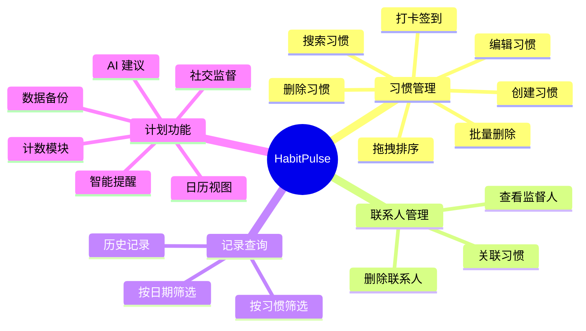

---

## 2. 架构层次图

### 2.1 整体架构总图

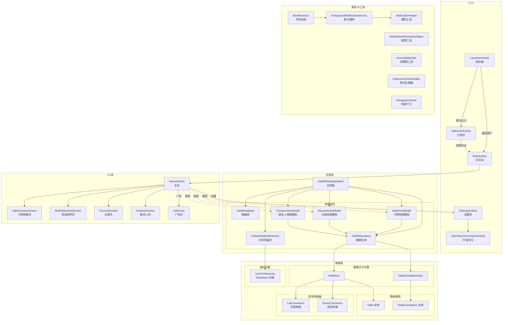

### 2.2 UI 层结构图

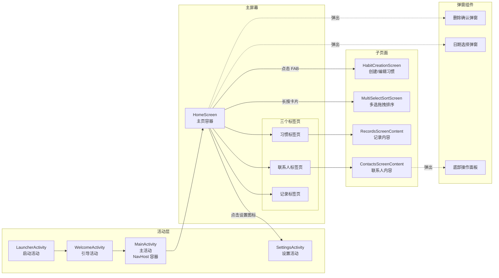

### 2.3 核心业务图

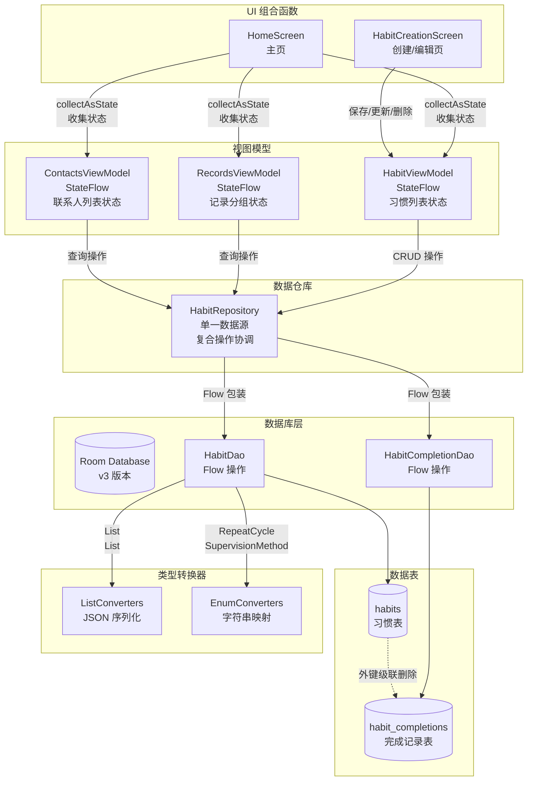

### 2.4 服务与工具图

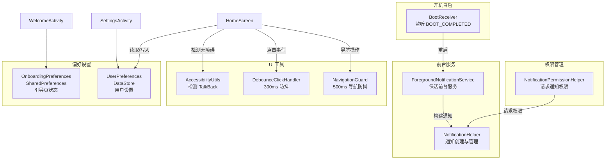

---

## 3. 数据库 ER 图

### 3.1 数据库 ER 图

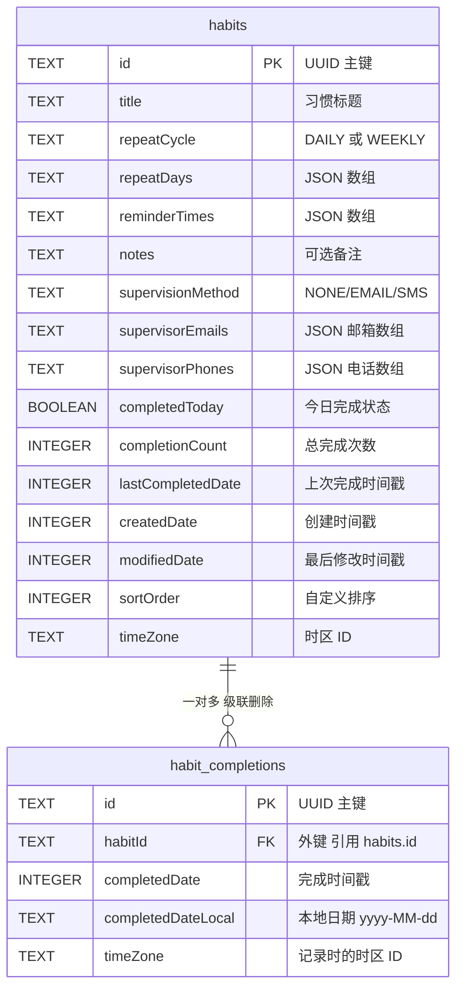

### 3.2 habits 表详细结构

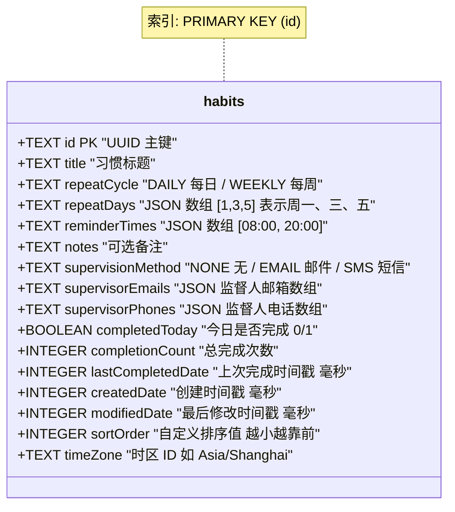

### 3.3 habit_completions 表详细结构

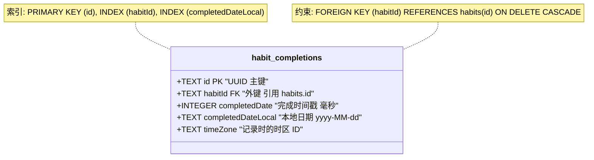

---

## 4. 响应式导航策略

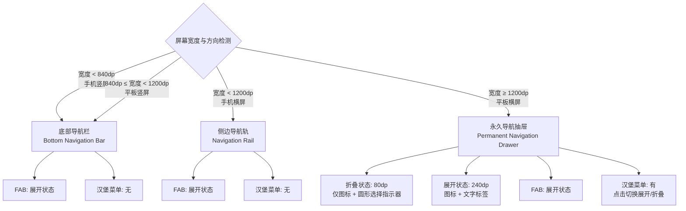

---

## 5. 核心架构模式

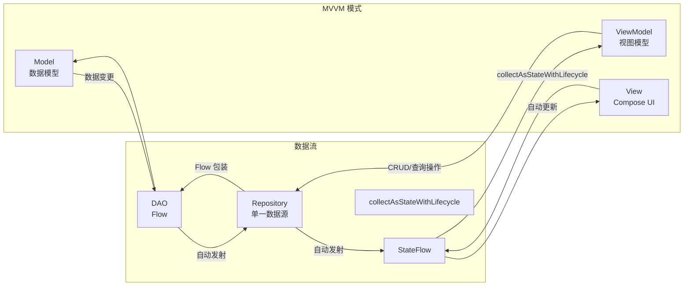

| 模式 | 实现方式 |
|------|----------|
| **MVVM** | ViewModel 暴露 `StateFlow<T>`，Compose 通过 `collectAsStateWithLifecycle` 收集 |
| **Repository** | 所有数据操作的单一数据源 |
| **响应式数据** | DAO 返回 `Flow<T>`，实现 UI 自动更新 |
| **单 Activity 架构** | 主应用使用 `MainActivity` + Navigation Compose |
| **共享元素过渡** | `SharedTransitionLayout` 实现页面动画切换 |
| **设备自适应 UI** | 基于 `screenWidthDp` 阈值的响应式导航 |
| **预测性返回手势** | Android 13+ 启用 `enableOnBackInvokedCallback` |
| **动态颜色** | Android 12+ Monet 动态主题 |

---

## 6. 数据库迁移历史

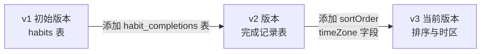

| 版本 | 变更内容 |
|------|----------|
| **v1** | 初始架构，创建 `habits` 表 |
| **v2** | 添加 `habit_completions` 表，外键级联删除 |
| **v3** | `habits` 表新增 `sortOrder` 和 `timeZone` 字段 |

---

## 7. 功能路线图

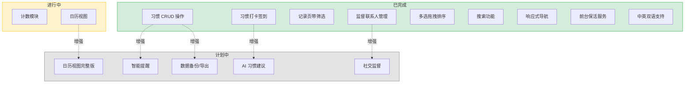

---

*最后更新: 2026 年 4 月 10 日*
