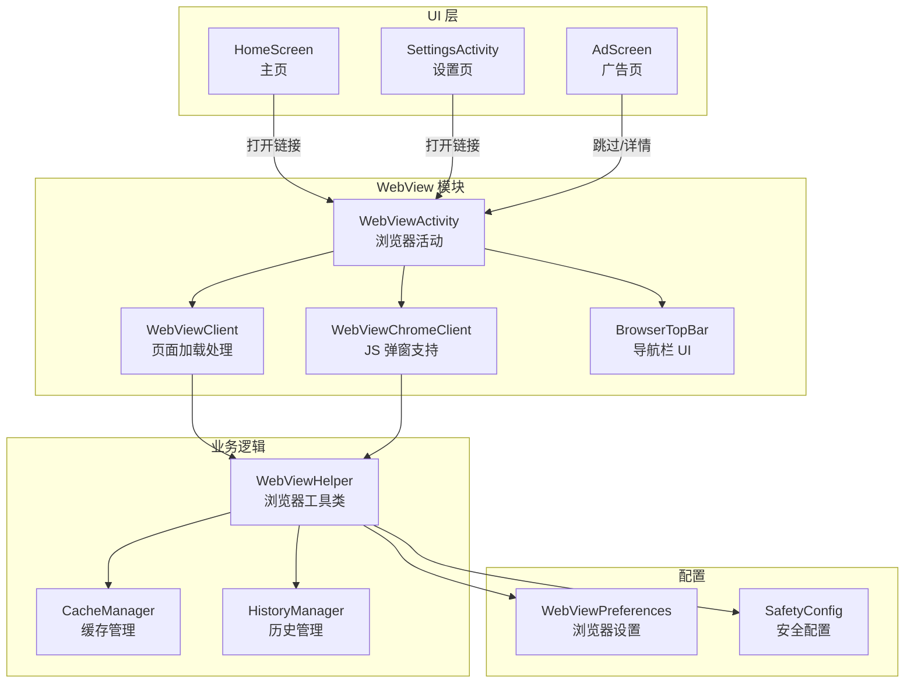
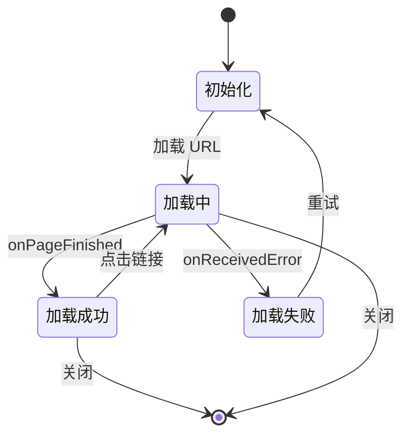
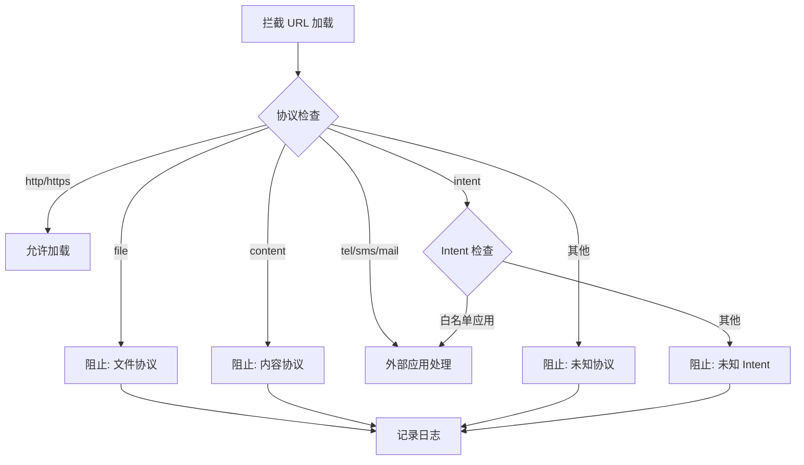

# 应用内 WebView 浏览器规划

## 概述

在 HabitPulse 中集成应用内 WebView 浏览器，用于展示广告、外部链接、帮助文档等内容，无需跳转到系统浏览器。

### 背景与动机

| 方案 | 优点 | 缺点 |
|------|------|------|
| **跳转系统浏览器** | 实现简单 | 不同浏览器行为不一致、用户体验割裂、可能唤起不想要的浏览器 |
| **Custom Tabs** | 性能较好 | 仍会离开应用、部分手机不支持、UI 不可定制 |
| **应用内 WebView** | ✅ 完全控制 UI/UX<br/>✅ 不离开应用<br/>✅ 可定制导航栏<br/>✅ 行为一致 | 需自行实现部分功能 |

**结论**：采用应用内 WebView 方案，提供更好的用户体验和控制力。

---

## 1. 架构设计



---

## 2. WebViewActivity 设计

### 2.1 界面布局

```
┌────────────────────────────────────────┐
│ ← 标题栏/URL                    [⋮]   │
├────────────────────────────────────────┤
│ [◀] [▶] [↻] [⊗]                       │
├────────────────────────────────────────┤
│                                        │
│                                        │
│            WebView 内容区               │
│                                        │
│                                        │
│                                        │
├────────────────────────────────────────┤
│ ████████████████████░░░░  加载进度条   │
└────────────────────────────────────────┘
```

### 2.2 功能清单

| 功能 | 说明 |
|------|------|
| **URL 显示** | 顶部显示当前页面 URL（可滚动截断） |
| **导航按钮** | 后退、前进、刷新、关闭 |
| **加载进度** | 线性进度条显示加载进度 |
| **标题显示** | 可选显示页面标题 |
| **更多菜单** | 在浏览器中打开、分享链接、复制链接 |
| **错误页面** | 网络错误时显示友好提示 |

### 2.3 状态管理



---

## 3. 安全配置

### 3.1 WebView 安全设置

```kotlin
webView.settings.apply {
    // 启用 JavaScript（广告等外部页面需要）
    javaScriptEnabled = true
    
    // 禁用文件访问
    allowFileAccess = false
    allowFileAccessFromFileURLs = false
    allowUniversalAccessFromFileURLs = false
    
    // 禁用内容提供者访问
    allowContentAccess = false
    
    // 启用缓存（提升体验）
    cacheMode = WebSettings.LOAD_DEFAULT
    
    // 支持缩放
    setSupportZoom(true)
    builtInZoomControls = true
    displayZoomControls = false
    
    // 自适应屏幕
    useWideViewPort = true
    loadWithOverviewMode = true
    
    // 禁用密码保存
    savePassword = false
    
    // 禁用第三方 Cookie（可选，根据隐私需求）
    // CookieManager.getInstance().setAcceptThirdPartyCookies(webView, false)
}
```

### 3.2 安全风险防范

| 风险 | 防范措施 |
|------|----------|
| **XSS 攻击** | 不向 WebView 暴露敏感数据，不使用 `addJavascriptInterface` |
| **文件泄露** | 禁用 `allowFileAccess`，不从 `file://` 加载内容 |
| **钓鱼网站** | 显示完整 URL，提供"在浏览器中打开"选项 |
| **Cookie 追踪** | 可选禁用第三方 Cookie，关闭时清除所有 Cookie |
| **恶意弹窗** | 自定义 `WebChromeClient` 限制弹窗行为 |
| **Intent 劫持** | 重写 `shouldOverrideUrlLoading`，拦截危险 scheme |

### 3.3 URL 拦截规则



---

## 4. 使用场景集成

### 4.1 广告页面 (AdScreen)

```kotlin
// 当前 AdScreen 升级为 WebView 展示
AdScreen(
    url = "https://your-ad-server.com/ad-page",
    onSkip = { navigateToHome() },
    countdownSeconds = 5
)
```

**特性**：
- 支持 HTML 广告内容
- 倒计时跳过按钮
- 加载失败时显示占位图
- 可配置广告 URL（远程配置或本地）

### 4.2 外部链接打开

```kotlin
// 从任何页面打开链接
LaunchedEffect(Unit) {
    openInAppUrl("https://github.com/DarrinYoung791/HabitPulse")
}
```

**触发位置**：
- SettingsActivity 的 GitHub 链接
- 帮助文档链接
- 隐私政策链接
- 用户反馈链接

### 4.3 帮助/FAQ 页面

```kotlin
// 可加载本地或远程 HTML 作为帮助文档
WebViewActivity.start(
    context = context,
    url = "file:///android_asset/help.html",  // 本地资源
    title = "使用帮助",
    showUrl = false  // 隐藏 URL 栏
)
```

---

## 5. 详细实现规划

### 5.1 WebViewActivity 实现

```kotlin
class WebViewActivity : AppCompatActivity() {
    
    companion object {
        private const val EXTRA_URL = "extra_url"
        private const val EXTRA_TITLE = "extra_title"
        private const val EXTRA_SHOW_URL = "extra_show_url"
        
        fun start(context: Context, url: String, title: String? = null, showUrl: Boolean = true) {
            Intent(context, WebViewActivity::class.java).apply {
                putExtra(EXTRA_URL, url)
                putExtra(EXTRA_TITLE, title)
                putExtra(EXTRA_SHOW_URL, showUrl)
            }.also {
                context.startActivity(it)
            }
        }
    }
    
    private lateinit var webView: WebView
    private lateinit var progressBar: LinearProgressIndicator
    private lateinit var urlTextView: TextView
    private var backButtonEnabled = true
    private var forwardButtonEnabled = false
    
    override fun onCreate(savedInstanceState: Bundle?) {
        super.onCreate(savedInstanceState)
        setContentView(R.layout.activity_webview)
        
        val url = intent.getStringExtra(EXTRA_URL) ?: return finish()
        val title = intent.getStringExtra(EXTRA_TITLE)
        val showUrl = intent.getBooleanExtra(EXTRA_SHOW_URL, true)
        
        setupWebView()
        setupToolbar(title, showUrl)
        setupNavigationButtons()
        
        webView.loadUrl(url)
    }
    
    // ... 其他实现
}
```

### 5.2 布局文件

```xml
<!-- res/layout/activity_webview.xml -->
<LinearLayout xmlns:android="http://schemas.android.com/apk/res/android"
    android:layout_width="match_parent"
    android:layout_height="match_parent"
    android:orientation="vertical">

    <!-- 顶部工具栏 -->
    <com.google.android.material.appbar.AppBarLayout
        android:layout_width="match_parent"
        android:layout_height="wrap_content">

        <Toolbar
            android:id="@+id/toolbar"
            android:layout_width="match_parent"
            android:layout_height="?attr/actionBarSize" />

        <!-- URL 显示 -->
        <TextView
            android:id="@+id/urlTextView"
            android:layout_width="match_parent"
            android:layout_height="wrap_content"
            android:padding="8dp"
            android:maxLines="1"
            android:ellipsize="end" />

        <!-- 进度条 -->
        <com.google.android.material.progressindicator.LinearProgressIndicator
            android:id="@+id/progressIndicator"
            android:layout_width="match_parent"
            android:layout_height="wrap_content"
            android:indeterminate="false" />
    </com.google.android.material.appbar.AppBarLayout>

    <!-- 导航按钮 -->
    <LinearLayout
        android:id="@+id/navigationBar"
        android:layout_width="match_parent"
        android:layout_height="wrap_content"
        android:orientation="horizontal">

        <ImageButton android:id="@+id/backButton" android:src="@drawable/ic_arrow_back" />
        <ImageButton android:id="@+id/forwardButton" android:src="@drawable/ic_arrow_forward" />
        <ImageButton android:id="@+id/refreshButton" android:src="@drawable/ic_refresh" />
        <ImageButton android:id="@+id/closeButton" android:src="@drawable/ic_close" />
    </LinearLayout>

    <!-- WebView 内容 -->
    <WebView
        android:id="@+id/webView"
        android:layout_width="match_parent"
        android:layout_height="0dp"
        android:layout_weight="1" />
</LinearLayout>
```

### 5.3 WebViewClient 实现

```kotlin
class SafeWebViewClient(
    private val onProgressChanged: (Int) -> Unit,
    private val onPageTitleChanged: (String) -> Unit,
    private val onUrlChanged: (String) -> Unit,
    private val onError: (String) -> Unit
) : WebViewClient() {
    
    override fun shouldOverrideUrlLoading(view: WebView?, request: WebResourceRequest?): Boolean {
        val url = request?.url?.toString() ?: return false
        
        return when {
            url.startsWith("http://") || url.startsWith("https://") -> {
                // 允许 http/https 加载
                false
            }
            url.startsWith("tel:") || url.startsWith("sms:") || url.startsWith("mailto:") -> {
                // 外部应用处理
                try {
                    val intent = Intent(Intent.ACTION_VIEW, Uri.parse(url))
                    view?.context?.startActivity(intent)
                } catch (e: Exception) {
                    // 忽略异常
                }
                true
            }
            else -> {
                // 阻止其他协议
                Log.w("SafeWebViewClient", "Blocked URL: $url")
                true
            }
        }
    }
    
    override fun onPageStarted(view: WebView?, url: String?, favicon: Bitmap?) {
        super.onPageStarted(view, url, favicon)
        onUrlChanged(url ?: "")
    }
    
    override fun onPageFinished(view: WebView?, url: String?) {
        super.onPageFinished(view, url)
        onProgressChanged(100)
    }
    
    override fun onReceivedError(
        view: WebView?,
        request: WebResourceRequest?,
        error: WebResourceError?
    ) {
        super.onReceivedError(view, request, error)
        onError(error?.description?.toString() ?: "加载失败")
    }
}
```

### 5.4 WebChromeClient 实现

```kotlin
class SafeWebChromeClient(
    private val onProgressChanged: (Int) -> Unit,
    private val onTitleChanged: (String) -> Unit
) : WebChromeClient() {
    
    override fun onProgressChanged(view: WebView?, newProgress: Int) {
        super.onProgressChanged(view, newProgress)
        onProgressChanged(newProgress)
    }
    
    override fun onReceivedTitle(view: WebView?, title: String?) {
        super.onReceivedTitle(view, title)
        if (title != null) {
            onTitleChanged(title)
        }
    }
    
    // 限制 JavaScript 弹窗
    override fun onJsAlert(view: WebView?, url: String?, message: String?, result: JsResult?): Boolean {
        // 可选择阻止或自定义显示
        result?.cancel()
        return true
    }
    
    override fun onJsConfirm(view: WebView?, url: String?, message: String?, result: JsResult?): Boolean {
        result?.cancel()
        return true
    }
    
    override fun onJsPrompt(view: WebView?, url: String?, message: String?, defaultValue: String?, result: JsPromptResult?): Boolean {
        result?.cancel()
        return true
    }
}
```

---

## 6. 与现有代码集成

### 6.1 修改 AdScreen

```kotlin
// 当前 AdScreen 占位符升级为 WebView
@Composable
fun AdScreen(
    onSkip: () -> Unit,
    viewModel: HabitViewModel
) {
    val showSplashAd by viewModel.splashAdEnabled.collectAsState()
    val adUrl = "https://your-ad-server.com/ad"  // 可从远程配置获取
    
    if (showSplashAd) {
        AdWebViewContent(
            url = adUrl,
            countdownSeconds = 5,
            onSkip = onSkip
        )
    } else {
        // 直接跳过
        LaunchedEffect(Unit) {
            onSkip()
        }
    }
}

@Composable
private fun AdWebViewContent(
    url: String,
    countdownSeconds: Int,
    onSkip: () -> Unit
) {
    var timeLeft by remember { mutableIntStateOf(countdownSeconds) }
    
    LaunchedEffect(Unit) {
        repeat(countdownSeconds) {
            delay(1000)
            timeLeft--
        }
    }
    
    Box(modifier = Modifier.fillMaxSize()) {
        AndroidView(
            factory = { context ->
                WebView(context).apply {
                    settings.javaScriptEnabled = true
                    webViewClient = WebViewClient()
                    loadUrl(url)
                }
            },
            modifier = Modifier.fillMaxSize()
        )
        
        // 倒计时跳过按钮
        Button(
            onClick = onSkip,
            enabled = timeLeft <= 0,
            modifier = Modifier
                .align(Alignment.TopEnd)
                .padding(16.dp)
        ) {
            if (timeLeft > 0) {
                Text("跳过 ($timeLeft)")
            } else {
                Text("跳过")
            }
        }
    }
}
```

### 6.2 SettingsActivity 集成

```kotlin
// GitHub 链接打开方式
@Composable
fun SettingsScreen(
    openUrl: (String) -> Unit
) {
    // ...
    TextButton(onClick = { openUrl("https://github.com/...") }) {
        Text("查看源代码")
    }
}

// 在调用处
val openUrl: (String) -> Unit = { url ->
    WebViewActivity.start(context, url, title = "GitHub")
}
```

### 6.3 扩展函数便捷调用

```kotlin
// Context 扩展
fun Context.openInAppWebView(url: String, title: String? = null, showUrl: Boolean = true) {
    WebViewActivity.start(this, url, title, showUrl)
}

// Compose 中使用
val context = LocalContext.current
IconButton(onClick = { 
    context.openInAppWebView("https://example.com", "帮助") 
}) {
    Icon(Icons.Default.HelpOutline, contentDescription = "帮助")
}
```

---

## 7. 权限与配置

### 7.1 AndroidManifest.xml

```xml
<uses-permission android:name="android.permission.INTERNET" />
<uses-permission android:name="android.permission.ACCESS_NETWORK_STATE" />

<application>
    <activity
        android:name=".ui.screens.WebViewActivity"
        android:configChanges="orientation|screenSize|keyboardHidden"
        android:enableOnBackInvokedCallback="true"
        android:exported="false"
        android:theme="@style/Theme.HabitPulse" />
</application>
```

### 7.2 依赖添加

```kotlin
// build.gradle.kts (app)
dependencies {
    // WebView 已包含在 Android SDK 中，无需额外依赖
    
    // 如果需要高级功能（如下载管理），可考虑：
    // implementation("androidx.browser:browser:1.8.0")  // Custom Tabs 备选
}
```

---

## 8. 测试计划

### 8.1 功能测试

| 测试项 | 预期结果 |
|--------|----------|
| 加载 http 页面 | 正常显示 |
| 加载 https 页面 | 正常显示 |
| 后退/前进按钮 | 正确导航 |
| 刷新按钮 | 重新加载当前页面 |
| 关闭按钮 | 返回上一页/关闭活动 |
| 网络错误 | 显示友好提示 |
| 慢速网络 | 进度条正确更新 |

### 8.2 安全测试

| 测试项 | 预期结果 |
|--------|----------|
| 尝试加载 file:// 协议 | 被阻止 |
| 尝试加载 content:// 协议 | 被阻止 |
| 尝试加载 intent:// | 被检查并阻止 |
| JavaScript 弹窗 | 被限制或自定义处理 |
| Cookie 泄漏 | 关闭后清除 Cookie |

### 8.3 兼容性测试

| 测试项 | 说明 |
|--------|------|
| Android 8.0 (API 26) | 最低版本测试 |
| Android 12+ (API 31+) | 新版 WebView 行为 |
| 不同屏幕尺寸 | 布局适配测试 |
| 横竖屏切换 | 状态保持测试 |

---

## 9. 实现步骤

### 阶段 1：基础实现（预计 1 天）
1. 创建 `WebViewActivity`
2. 实现基本布局（Toolbar + WebView）
3. 实现 URL 加载和导航
4. 实现后退/前进/刷新/关闭按钮

### 阶段 2：安全加固（预计 0.5 天）
1. 实现 `SafeWebViewClient` URL 拦截
2. 实现 `SafeWebChromeClient` 弹窗限制
3. 配置 WebView 安全设置
4. 添加 Cookie 清除逻辑

### 阶段 3：UI 优化（预计 0.5 天）
1. 加载进度条动画
2. 错误页面设计
3. 更多菜单实现
4. URL 显示优化

### 阶段 4：集成测试（预计 0.5 天）
1. AdScreen 集成
2. SettingsActivity 链接集成
3. 安全测试
4. 兼容性测试

---

## 10. 未来扩展

- **下载管理**：支持文件下载并通知系统
- **阅读模式**：简化页面内容
- **深色模式**：强制网页应用深色主题
- **广告拦截**：基础广告过滤规则
- **标签页**：多标签浏览（如需）
- **搜索引擎**：地址栏集成搜索

---

*创建时间: 2026 年 4 月 10 日*
