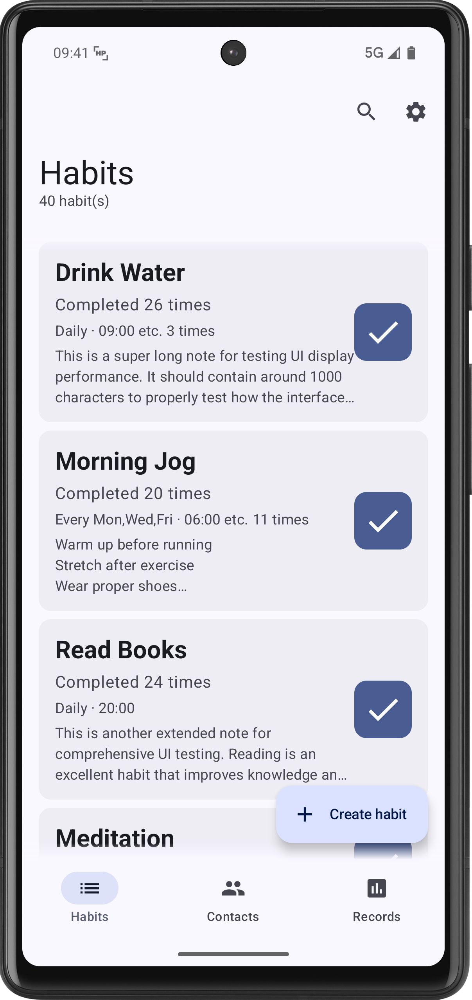
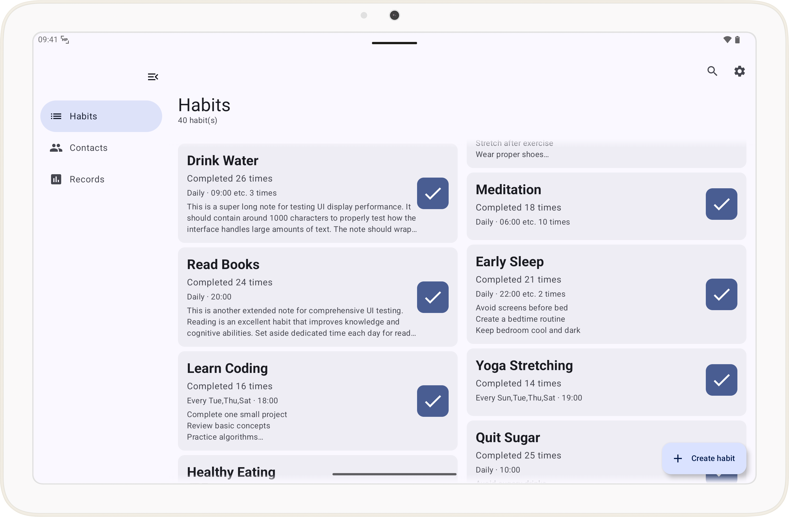
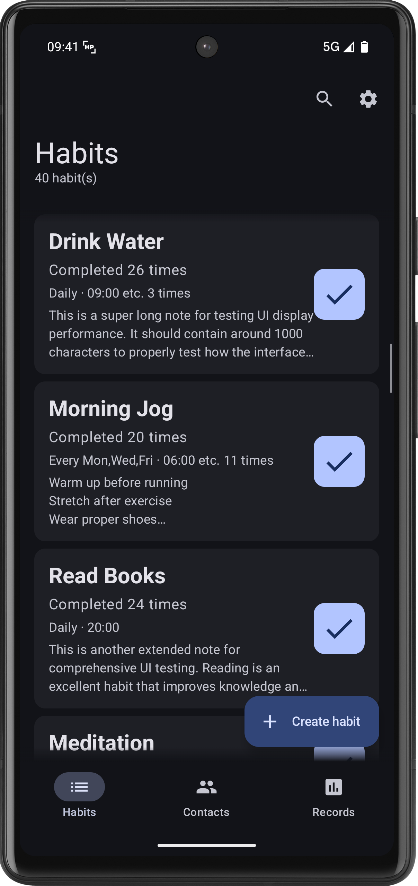
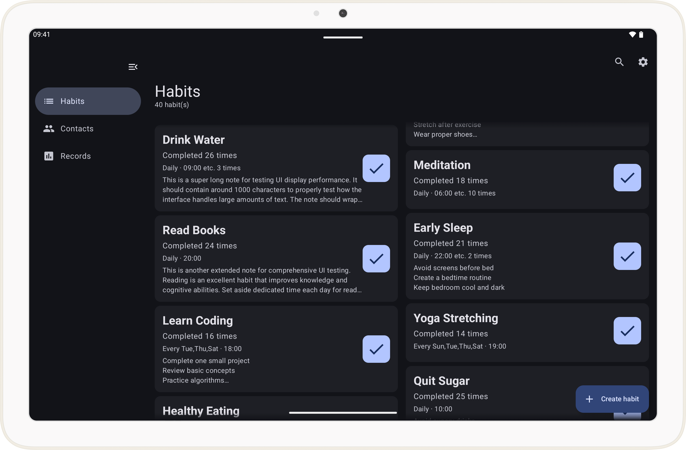

# HabitPulse

<div align="center">

[](https://choosealicense.com/licenses/MIT/)
[](https://developer.android.com/)
[](https://kotlinlang.org/)
[](https://developer.android.com/jetpack/compose/bom)
[](https://developer.android.com/training/data-storage/room)
[](https://developer.android.com/about/versions/oreo/android-8.0-api-26)

</div>

---

## 📱 Introduction

**HabitPulse** is an Android habit tracking application built with Material Design 3, dedicated to helping users build and maintain good daily habits. Through a concise and intuitive interface design and intelligent reminder mechanisms, habit formation becomes easier and more effective.

> [!NOTE]
>
> HabitPulse is developed with AI assistance. If you use Qwen Code or Claude Code for further development, please read [`QWEN.md`](QWEN.md) for important information.

> 🌏 [Chinese Version](../../README.md) | English Version

---

## ✨ Features

### 🎯 Core Features
- [x] **Habit Tracking**: Create, manage, and track daily habits, recording every check-in
- [x] **Check-in Records**: Complete check-in history, supporting viewing completion status for any date
- [x] **Multi-Select & Sort**: Long-press habit cards to enter multi-select mode, supporting drag-and-drop sorting and batch deletion
- [ ] **Supervisor Contacts**: Add supervisor emails or phone numbers to notify designated contacts of habit completion status (Planned)
- [ ] **Smart Reminders**: Time-based reminder feature to help users stick to habits (Planned)
- [ ] **AI-Assisted Planning**: Integrate LLM APIs to use AI for assisting users in creating habits (Planned)
- [ ] **Records Visualization**: Use WebView and web components to create visualizations, such as weekly check-in time distributions (Planned)

### 🎨 UI/UX Features
- **Material Design 3**: Follows the latest MD3 design specifications with a clean and beautiful interface
- **Dynamic Color**: Supports dynamic theming (Material You) on Android 12+
- **Responsive Layout**: Perfectly adapts to phones and tablets, supporting landscape and portrait orientation switching
- **Split-Screen Support**: Supports multi-window and picture-in-picture modes
- **Accessibility Optimization**: Full TalkBack support, caring for every user
- **Predictive Back Gesture**: Android 13+ predictive back gesture support

### 🔧 Technical Features
- **Jetpack Compose**: Declarative UI framework for a modern development experience
- **Room Database**: Local data persistence, available offline
- **ViewModel + Flow**: Reactive architecture, data-driven UI
- **Navigation Component**: Navigation Compose for smooth page transition animations

---

## 🖼️ Interface Preview

<div align="center">

| <div align="center">**Phone Interface**</div>                | <div align="center">**Tablet Interface**</div>               |
| ------------------------------------------------------------ | ------------------------------------------------------------ |
|  |  |
|  |  |

</div>

---

## 🚀 Quick Start

### Requirements
- **Android Studio**: Latest version
- **JDK**: 17 or higher
- **Android SDK**:
  - Minimum SDK: 26 (Android 8.0)
  - Target SDK: 36 (Android 16)

### Clone the Project
```bash
git clone https://github.com/darrindeyoung791/HabitPulse.git
cd HabitPulse
```

### Build the Project

Open the project with the latest version of Android Studio and follow the prompts.

Or use other IDEs or editors.

```bash
# Build using Gradle Wrapper
./gradlew assembleDebug

# Or open the project in Android Studio and run directly
```

> [!IMPORTANT]
> - You may need to manually modify the JDK path in [`gradle.properties`](gradle.properties) in the project.
> - This project is configured to use mirrors from Tencent Cloud and Aliyun. If you are a developer outside mainland China, you will need to modify these settings.

#### VSCode Users

If you use VSCode for development, you need to configure the JDK 17 path in [`.vscode/settings.json`](.vscode/settings.json):

```json
{
    "java.jdt.ls.java.home": "C:\\\\Program Files\\\\Java\\\\jdk-17",
    "java.home": "C:\\\\Program Files\\\\Java\\\\jdk-17"
}
```

> [!IMPORTANT]
>
> Please modify the above configuration according to your actual JDK installation path. The default path on Windows is usually `C:\\Program Files\\Java\\jdk-17`, and on macOS it is usually `/Library/Java/JavaVirtualMachines/jdk-17.jdk/Contents/Home`.
>
> After configuration is complete, press `Ctrl+Shift+P` and select **"Java: Clean Java Language Server Workspace"**, or reload the VSCode window to make the configuration take effect.

### Install the Application
```bash
# Install to connected device via ADB
./gradlew installDebug
```

---

## 🛠️ Tech Stack

| Component | Version | Description |
|------|------|------|
| **Language** | Kotlin 2.3.20 | Modern Android development language |
| **UI Framework** | Jetpack Compose (BOM 2026.03.00) | Declarative UI framework |
| **Material 3** | 1.4.0 | Material Design 3 component library |
| **Navigation** | Navigation Compose 2.8.0 | Page navigation and animations |
| **Database** | Room 2.8.4 | Local data persistence |
| **Lifecycle** | 2.10.0 | Lifecycle-aware components |
| **ViewModel** | 2.8.7 | UI state management |
| **Build Tools** | Gradle 9.4.0 + AGP 9.1.0 | Project build system |
| **JVM Target** | Java 17 | Compiled bytecode version |

---

## 📦 Project Structure

```
HabitPulse/
├── app/
│   ├── src/main/
│   │   ├── java/io/github/darrindeyoung791/habitpulse/
│   │   │   ├── MainActivity.kt              # Main entry point
│   │   │   ├── SettingsActivity.kt          # Settings screen
│   │   │   ├── HabitPulseApplication.kt     # Application class
│   │   │   ├── navigation/                  # Navigation graph
│   │   │   ├── data/                        # Data layer
│   │   │   │   ├── model/                   # Data models
│   │   │   │   ├── database/                # Room database
│   │   │   │   └── repository/              # Data repository
│   │   │   ├── viewmodel/                   # ViewModel layer
│   │   │   └── ui/                          # UI layer
│   │   │       ├── screens/                 # Screen composables
│   │   │       └── theme/                   # Theme styling
│   │   └── res/                             # Resource files
│   └── build.gradle.kts                     # Module build configuration
├── gradle/                                  # Gradle Wrapper
├── QWEN.md                                  # Project context documentation
└── README.md                                # Project documentation
```

---

## 📄 Database Design

### Core Tables

#### habits Table
Stores all habit information created by users.

| Field | Type | Description |
|------|------|------|
| id | TEXT (PRIMARY KEY) | Habit unique identifier (UUID) |
| title | TEXT | Habit title |
| repeatCycle | TEXT | Repeat cycle (DAILY/WEEKLY) |
| repeatDays | TEXT | Repeat days (JSON format) |
| reminderTimes | TEXT | Reminder times (JSON format) |
| notes | TEXT | Notes |
| supervisionMethod | TEXT | Supervision method (NONE/EMAIL/SMS) |
| supervisorEmails | TEXT | Supervisor emails (JSON format) |
| supervisorPhones | TEXT | Supervisor phones (JSON format) |
| completedToday | INTEGER | Today's completion status (0/1) |
| completionCount | INTEGER | Total completion count |
| lastCompletedDate | INTEGER | Last completion timestamp |
| createdDate | INTEGER | Creation timestamp |
| modifiedDate | INTEGER | Modification timestamp |
| sortOrder | INTEGER | Sort order, lower values appear first, used for custom sorting |
| timeZone | TEXT | Timezone ID, used for cross-timezone scenarios |

#### habit_completions Table
Records detailed information for each habit check-in.

| Field | Type | Description |
|------|------|------|
| id | TEXT (PRIMARY KEY) | Record unique identifier (UUID) |
| habitId | TEXT (FOREIGN KEY) | Associated habit ID |
| completedDate | INTEGER | Completion timestamp |
| completedDateLocal | TEXT | Local date (yyyy-MM-dd) |
| timeZone | TEXT | Timezone information |

> 📚 Detailed database design documentation will be provided in future updates

---

## 🤝 Contributing

We welcome all forms of contributions!

### How to Contribute
1. **Fork** this project
2. Create your feature branch (`git checkout -b feature/AmazingFeature`)
3. Commit your changes (`git commit -m 'Add some AmazingFeature'`)
4. Push to the branch (`git push origin feature/AmazingFeature`)
5. Open a **Pull Request**

### Development Environment Setup
1. After cloning the project, open it with Android Studio
2. Sync the Gradle project
3. Run `./gradlew assembleDebug` to ensure the build is successful
4. Run debugging on an emulator or real device

### Code Style
- Follow the [Kotlin Style Guide](https://kotlinlang.org/docs/coding-conventions.html)
- Use KDoc for documentation comments
- Keep code clean and follow the DRY principle

### Reporting Issues
Found a bug? Please report it via [Issues](https://github.com/darrindeyoung791/HabitPulse/issues).

---

## 📜 License

This project is open source under the [MIT License](LICENSE).

```
MIT License

Copyright (c) 2026 darrindeyoung791

Permission is hereby granted, free of charge, to any person obtaining a copy
of this software and associated documentation files (the "Software"), to deal
in the Software without restriction, including without limitation the rights
to use, copy, modify, merge, publish, distribute, sublicense, and/or sell
copies of the Software, and to permit persons to whom the Software is
furnished to do so, subject to the following conditions:

The above copyright notice and this permission notice shall be included in all
copies or substantial portions of the Software.

THE SOFTWARE IS PROVIDED "AS IS", WITHOUT WARRANTY OF ANY KIND, EXPRESS OR
IMPLIED, INCLUDING BUT NOT LIMITED TO THE WARRANTIES OF MERCHANTABILITY,
FITNESS FOR A PARTICULAR PURPOSE AND NONINFRINGEMENT. IN NO EVENT SHALL THE
AUTHORS OR COPYRIGHT HOLDERS BE LIABLE FOR ANY CLAIM, DAMAGES OR OTHER
LIABILITY, WHETHER IN AN ACTION OF CONTRACT, TORT OR OTHERWISE, ARISING FROM,
OUT OF OR IN CONNECTION WITH THE SOFTWARE OR THE USE OR OTHER DEALINGS IN THE
SOFTWARE.
```

---

<div align="center">

**Made with ❤️ by darrindeyoung791**

[⭐ Star this repo](https://github.com/darrindeyoung791/HabitPulse/stargazers) | [🍴 Fork](https://github.com/darrindeyoung791/HabitPulse/fork) | [📢 Issues](https://github.com/darrindeyoung791/HabitPulse/issues)

</div>
